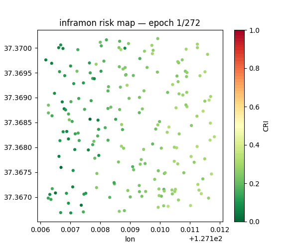
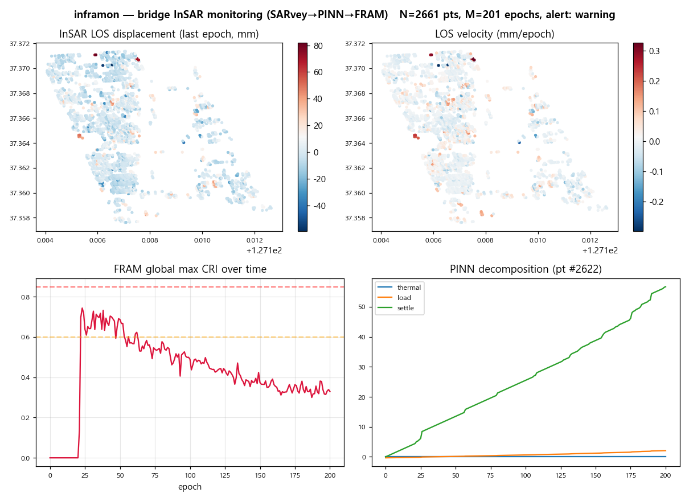
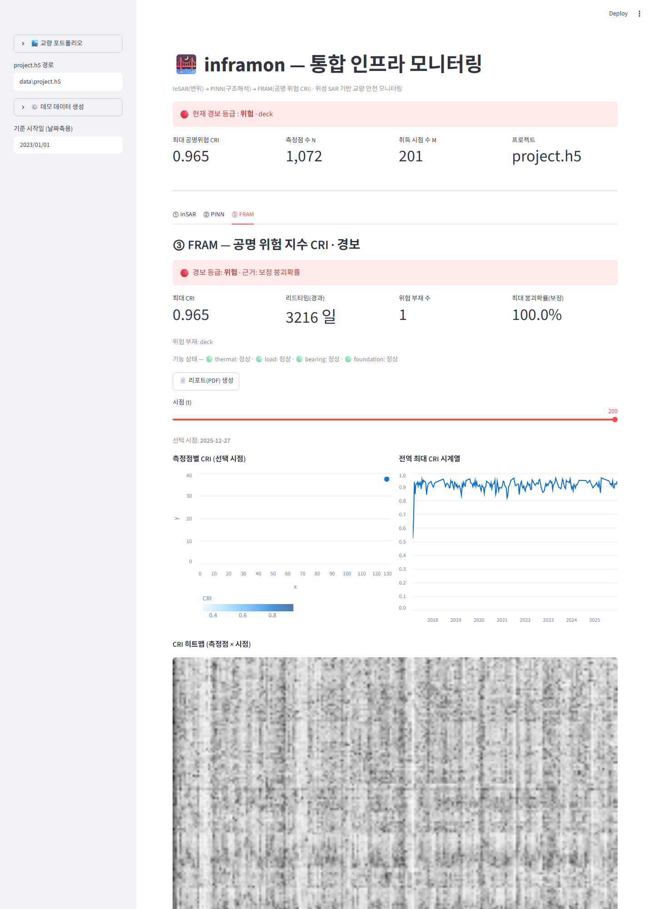
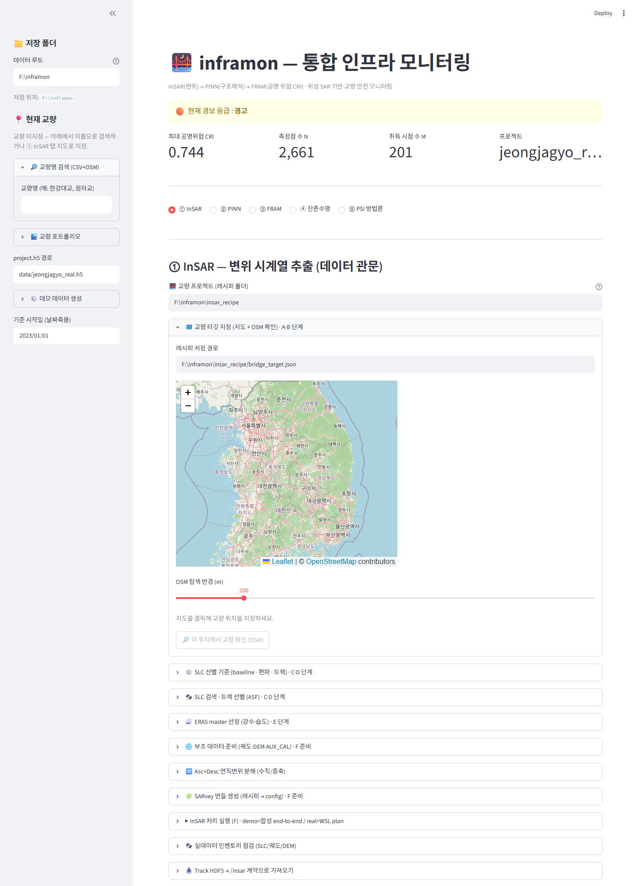
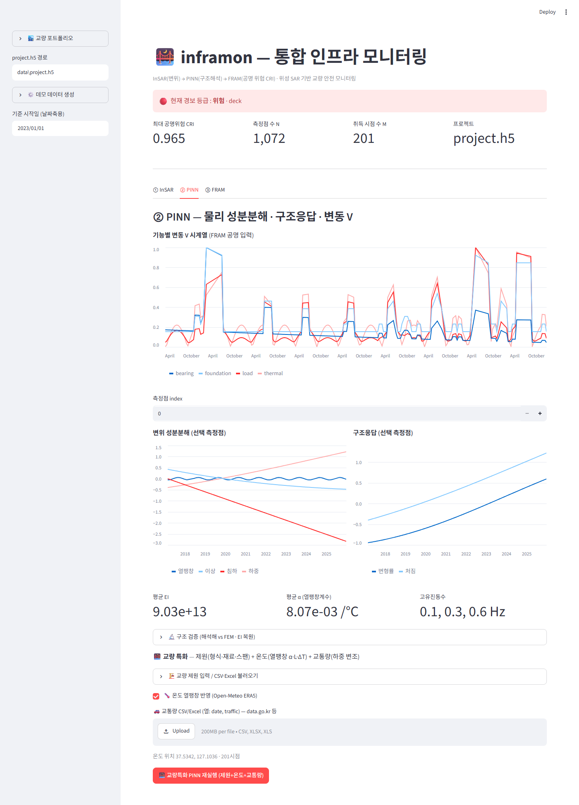

# inframon — 통합 인프라 모니터링 플랫폼

InSAR · PINN · CV · FRAM 4대 엔진을 하나의 파이프라인으로 묶어
교량 변위를 추출하고(InSAR), 구조적 의미를 풀고(PINN), 측정 영역을 자동 산정하고(CV),
시스템 안전을 진단(FRAM, 공명 위험 지수 CRI)한다.

설계 원본: [`docs/모듈별_상세설계_InSAR_PINN_CV_FRAM.md`](docs/모듈별_상세설계_InSAR_PINN_CV_FRAM.md)
개발 맥락: [`docs/개발_맥락_맵.md`](docs/개발_맥락_맵.md) (전체) · [`docs/맥락/`](docs/맥락/README.md) (엔진별 — InSAR/PINN/FRAM 작업 시 해당 부분만)

> ⚠️ **Status: 연구용 프로토타입 (Research prototype)**
> 실 Sentinel-1 → SARvey → PINN → FRAM **전 파이프라인 실행**과 **해석해 기반 PINN/FEM 검증(오차 <0.1%)** 은 실증됨.
> 그러나 **현장 실측(상시진동시험 AVT·GNSS/수준측량)·상용 FEM(SAP2000 등)·실 붕괴·점검 라벨** 기반 검증은 **미수행**이며,
> isotonic 붕괴확률은 **합성 Morandi 라벨** 기반이다. 표시되는 변위·CRI·붕괴확률은 **파이프라인 산출**이지 검증된 구조 진단이 아니다.
> **실무 교량 안전 판정 용도로 사용하지 마세요.**

## 미리보기 (Preview)

> 아래는 정자교 실 Sentinel-1 데이터를 **다운로드→ISCE2 코레지→MiaplPy→SARvey→PINN→FRAM**
> 으로 처리한 실제 산출(`data/project.h5`)로 생성한 결과 시각화다 (`scripts/make_readme_media.py`).



*시간에 따른 교량 위험(CRI/붕괴확률) 변화 — 정자교 PS/DS 점군.*



*InSAR LOS 변위 · LOS 속도 지도 · FRAM 전역 CRI 시계열 · PINN 성분분해(열팽창/하중/침하).*

### 라이브 대시보드 (Streamlit)



*③ FRAM 탭 — 실 SARvey 결과(1,072점×201시점): 경보 위험·deck, 최대 CRI 0.965, CRI 시계열·히트맵.*



*① InSAR 탭 — 교량 선택(OSM)·SLC 검색·보조데이터·Asc+Desc·정확도 보정 단계.*



*② PINN 탭 — 변위 성분분해·구조응답·EI/α/고유진동수·구조검증·교량특화(제원·온도·교통량).*

> 스크린샷 재생성: `python scripts/capture_dashboard.py` (대시보드 실행 중 + playwright 필요).

## 현재 단계 — 4대 엔진 real 구현 + 핫스왑 (합성 검증 완료)

데이터 계약(Pydantic + HDF5)과 골격을 **성역**으로 두고, 4대 엔진을 stub→real 로
모두 채웠다. stub/real 을 자유 조합(`--engine X=real`)할 수 있고, 골든 회귀가
계약·수치를 보호한다. 정확도 게이트(부재 mIoU·축선·Morandi ROC-AUC·isotonic 캘리브)는
**합성으로 통과**, 실 수치 게이트는 실데이터·실 제원·실 가중치 대기.

```
CV   → ROI/부재 시맨틱 분할/축선/지오레퍼런스   (cv/{engine,real_engine}.py)   STUB + REAL
InSAR → Track H5 → CV 정합·world xyz·변위 시계열 (insar/{engine,real_engine}.py) STUB + REAL
PINN → 성분분해 + Euler-Bernoulli PDE + 절대 EI  (pinn/{engine,real_engine}.py)  STUB + REAL
FRAM → 점별 공명·함수망(N-K)·CRI + 경보·보정확률  (fram/{engine,real_engine}.py)  STUB + REAL
```

> 핫스왑: `--engine cv=real --engine insar=real --engine pinn=real --engine fram=real`.
> 상태·설계 상세는 [`docs/개발_맥락_맵.md`](docs/개발_맥락_맵.md).

## 빠른 시작

```powershell
# (권장) conda 환경 — InSAR 계열(GDAL 등) 때문에
conda env create -f environment.yml
conda activate inframon

# 또는 코어만 (합성 데모는 이것만으로 충분)
pip install -e ".[dev]"

# 환경·데이터 준비도 진단
python -m inframon --doctor

# 전체 파이프라인 실행(전부 stub) → data/project.h5 생성 + CRI 출력
python -m inframon --demo

# 테스트
pytest -q

# 대시보드 (선택)
pip install -e ".[dashboard]"
streamlit run src/inframon/dashboard/app.py
```

## 실데이터 (실 Sentinel-1 → CRI)

합성·데모를 넘어 실제 위성 데이터로 돌리는 절차는 **[`docs/실데이터_런북.md`](docs/실데이터_런북.md)** 참고.
무거운 SAR 처리(ISCE2/MiaplPy/SARvey)는 WSL2/Linux, 나머지(선별·인제스트·해석·시각화)는 Windows.

```powershell
# 1. 준비도 진단 (의존성·기능 게이트, 선택적으로 데이터 인벤토리/Track preflight 포함)
python -m inframon --doctor                 # 환경만
python -m inframon --doctor <데이터루트>     # + InSAR 인벤토리
python -m inframon --doctor <track.h5>      # + Track preflight

# 2. (WSL2에서 SARvey 처리 → track.h5 산출 후) 투입 전 사전검증
python -m inframon --check-track track.h5   # 투입 가능=exit 0 / 불가=exit 1

# 3. 실 엔진 핫스왑으로 전체 실행
python -m inframon --demo --insar-source track.h5 --out data/project.h5 `
  --engine cv=real --engine insar=real --engine pinn=real --engine fram=real
```

- `--doctor` — 환경 진단(torch/rasterio/pyproj/asf_search/transformers 등 → 가능한 기능).
- `--inspect-data <root>` — 실 SLC/궤도/DEM/master 인벤토리 점검.
- `--check-track <h5>` — Track H5 투입 사전검증(필수 데이터셋·형상·날짜·coherence·CRS).

## 구조

```
src/inframon/
  contracts/   # ★ 모듈 간 데이터 계약 (schema.py = 4모듈 입출력, io.py = project.h5)
  cv/ insar/ pinn/ fram/   # 4대 엔진
  orchestrator/            # CV→InSAR→PINN→FRAM 순차 실행
  dashboard/               # Streamlit 대시보드
```

## 로드맵 현황

| 영역 | 상태 | 비고 |
|---|---|---|
| 골격 + 계약 + 핫스왑 + 골든회귀 | ✅ | contracts 성역, `--engine X=real` |
| CV real | ✅ 합성 검증 | 분할(Transformer 폴백)·축선·지오레퍼런스·부재(SAM 폴백) |
| InSAR 선별 A~E + 인제스트 G | ✅ | OSM·ASF·ERA5·SARvey 번들 / Track H5 정합 |
| InSAR 코어 F (SARvey) | 🟡 | 어댑터·계약·셸 검증됨, **외부 도구 실행은 WSL2** |
| PINN real | ✅ 합성 검증 | PyTorch PINN + Euler-Bernoulli PDE + FEM + 절대 EI |
| FRAM real | ✅ 합성 검증 | 점별·함수망(N-K) 공명·절대보정·isotonic 캘리브 |
| 실데이터 수치 게이트 (G2~G5) | ⬜ | 실 SLC·실 제원·실 가중치 필요 → [실데이터 런북](docs/실데이터_런북.md) |

> 테스트 156개(합성·데모). 실데이터 투입은 `--doctor`/`--check-track` 게이트 + [런북](docs/실데이터_런북.md).

## 기반 InSAR 도구 · 귀속 (Attribution)

inframon 은 InSAR 다중시기 처리에 아래 오픈소스 도구를 **엔진으로 호출**한다(별도 설치,
WSL2/Linux). inframon 은 이들의 소스를 포함하지 않고 CLI 로 오케스트레이션한다.

- **SARvey** (기본 InSAR 엔진, PS/DS 시계열) — https://github.com/luhipi/sarvey · GPLv3
- **MiaplPy** (위상연결·SLC 스택) — https://github.com/insarlab/MiaplPy · GPLv3
- **MintPy** (InSAR 시계열) — https://github.com/insarlab/MintPy · GPLv3
- **ISCE2** (Sentinel-1 topsStack 코레지) — https://github.com/isce-framework/isce2

> InSAR 엔진은 **플러그블**이다 — SARvey 가 기본값이며 MiaplPy/MintPy/StaMPS 어댑터도 제공
> (`scripts/wsl_sarvey/5x_*_to_inframon.py`). inframon 의 고유 기여는 **데이터 선별(OSM·ASF·ERA5),
> 구조 해석(PINN), 기능공명(FRAM), 대시보드·검증·정확도 보정** 계층이다.

데이터: Copernicus Sentinel-1(ASF)·GLO-30 DEM·ERA5(Open-Meteo)·OpenStreetMap(ODbL).
사용 시 각 제공처 약관·인용 요건을 따른다. 상세는 [`NOTICE.md`](NOTICE.md).

## 인용 (Citation)

inframon 을 연구에 사용하면 inframon 과 **기반 도구(특히 SARvey)를 함께 인용**해 주세요.
서지정보는 [`CITATION.cff`](CITATION.cff) 참조.

## 라이선스

**GPLv3** — [`LICENSE`](LICENSE) 참조. 기여 지침은 [`CONTRIBUTING.md`](CONTRIBUTING.md).
