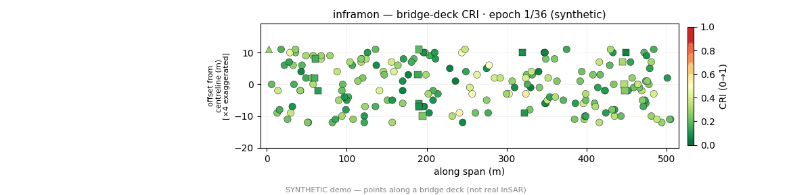
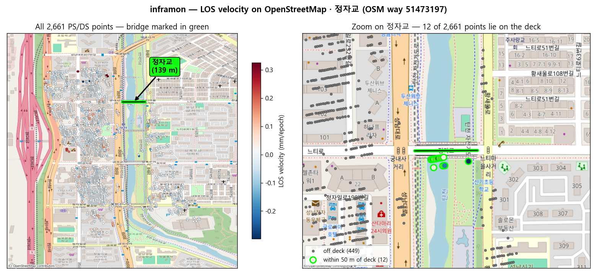

# inframon — Bridge Infrastructure Monitoring Platform · 교량 인프라 모니터링 플랫폼


**[English](#english) · [한국어](#한국어)**

> ⚠️ **Research prototype / 연구용 프로토타입.** Full pipeline + analytic PINN/FEM validation
> (error < 0.1%) demonstrated; field / commercial-FEM / real-failure-label validation **not yet done**.
> Outputs are pipeline results, **not** validated diagnoses — do not use for operational safety decisions. ·
> 전 파이프라인·해석해 검증은 실증됨, 현장·상용FEM·실 붕괴라벨 검증은 미수행 — **실무 안전 판정용 아님.**

**Concept — points ON a bridge deck (synthetic demo) / 개념 — 교량 데크 위 점 (합성 데모):**



*Illustrative **synthetic** demo — monitoring points along a modeled bridge deck (deck·pier·abutment),
CRI 🟢→🔴 over time. **Not real InSAR.** · 모델 교량 데크 위 점의 CRI 시간변화(합성, 실측 아님).*

**Real data (Jeongja Br., Sentinel-1) on OpenStreetMap / 실 데이터 (정자교) OSM 위:**



*Real SARvey result — PS/DS points sit on **surrounding buildings**; a smooth bridge deck over a river
has **few natural scatterers**, so deck points are sparse (needs corner reflectors / high-res SAR — see
Status). · 실 결과: 점이 주변 건물에 분포, 매끈한 교량 데크엔 산란체가 적어 데크 점은 희소(코너리플렉터/고해상도 SAR 필요).*


*Real Jeongja Bridge Sentinel-1 result (1,072 pts × 201 epochs) — dashboard FRAM / PINN / InSAR tabs. ·
정자교 실 Sentinel-1 결과 — 대시보드 FRAM/PINN/InSAR 탭. Regenerate: `scripts/{make_readme_media,capture_dashboard}.py`.*

---

## English

inframon chains four engines into one pipeline to monitor bridge safety from satellite SAR:
**InSAR** extracts displacement time series, **PINN** recovers structural meaning (physics),
**CV** auto-delineates the measurement region, and **FRAM** diagnoses system safety via a Composite
Resonance Index (CRI).

### Architecture

Data contracts (Pydantic + HDF5) and the skeleton are **sacred**; each engine is swapped stub→real
independently (hot-swap `--engine X=real`), protected by golden-regression tests.

```
CV    → ROI / member segmentation / axis / georeference   (cv/{engine,real_engine}.py)   STUB + REAL
InSAR → Track H5 → CV registration · world xyz · series    (insar/{engine,real_engine}.py) STUB + REAL
PINN  → decomposition + Euler-Bernoulli PDE + absolute EI   (pinn/{engine,real_engine}.py)  STUB + REAL
FRAM  → pointwise resonance · function net (N-K) · CRI      (fram/{engine,real_engine}.py)  STUB + REAL
```

### Repository structure

```
inframon/
├── src/inframon/          # main package (installable: pip install -e .)
│   ├── contracts/         # Pydantic + HDF5 data contract — the "sacred" schema (schema, io, array_schema)
│   ├── cv/                # CV engine: ROI / segmentation / axis / georeference        (engine + real_engine)
│   ├── insar/             # InSAR engine: Track H5 → world xyz series, DEM, ERA5 master, fusion (engine + real_engine)
│   ├── pinn/              # PINN engine: decomposition + Euler-Bernoulli PDE + absolute EI (engine + real_engine, pde)
│   ├── fram/              # FRAM engine: pointwise resonance · function net (N-K) · CRI (engine + real_engine, network)
│   ├── orchestrator/      # pipeline wiring · hot-swap engine registry · incremental resume
│   ├── api/               # FastAPI service (--serve) + engine registry / transform
│   ├── dashboard/         # Streamlit app (FRAM / PINN / InSAR tabs)
│   ├── __main__.py        # CLI entry — --demo / --doctor / --check-track / --engine X=real
│   └── config.py · doctor.py · export.py · geotransform.py · schedule.py · weather.py · traffic.py …
├── tests/                 # 43 test files (304 tests) — golden regression, contract validation, per-engine *_real
├── docs/                  # design & context docs (KR) + GitHub Pages landing (index.html)
├── scripts/               # SLC download, WSL2 SARvey runners, dashboard / media capture
├── examples/              # runnable examples (bmaps_tab)
├── .github/workflows/     # CI — tests.yml (pytest on Python 3.11)
├── CITATION.cff · LICENSE (GPLv3) · NOTICE.md · CONTRIBUTING.md
└── pyproject.toml · environment.yml
```

> **System overview** — architecture, BMAPS synchronization, and originality vs. the underlying
> InSAR tools are summarized in [`docs/시스템_개요.md`](docs/시스템_개요.md).

### Quick start

```bash
pip install -e ".[dev]"
python -m inframon --doctor     # environment / readiness check
python -m inframon --demo       # full pipeline (stubs) → data/project.h5 + CRI
pytest -q                       # tests
pip install -e ".[dashboard]" && streamlit run src/inframon/dashboard/app.py   # dashboard
```

### Real data (real Sentinel-1 → CRI)

Heavy SAR processing (ISCE2 / MiaplPy / SARvey) runs on **WSL2/Linux**; selection, ingest, analysis
and visualization run on Windows. See `docs/실데이터_런북.md`.

```bash
python -m inframon --check-track track.h5      # pre-ingest validation (exit 0 = ready)
python -m inframon --demo --insar-source track.h5 --out data/project.h5 \
  --engine cv=real --engine insar=real --engine pinn=real --engine fram=real
```

**Accuracy corrections (opt-in).** `--insar-corrections` runs three steps on the LOS series
*before* PINN/FRAM consume it, and stores the corrected rate at `/insar/velocity_mm_yr`:

```bash
python -m inframon --import-track-h5 track.h5 --out data/project.h5 \
  --insar-corrections --insar-dem dem.tif \
  --insar-thermal --insar-temp-csv temps.csv    # or --insar-fetch-temp (ERA5, no key)
```

The same flags apply to the full chain (`--demo --engine insar=real --insar-source track.h5 …`),
but that path registers Track coordinates against the CV frame, so it needs a geo-referenced CV
input (GeoTIFF / override) — without one the points fall outside the ROI. `--import-track-h5`
is the verified route for a bare SARvey/MintPy product.

| Step | What it removes | Requires | Notes |
|---|---|---|---|
| Common-mode (APS) | epoch-wise atmospheric phase, as the median of high-coherence stable points | `coherence` | `--ref-min-coherence` (default 0.9). **Benefit-guarded**: kept only if temporal std actually drops — SARvey already APS-filters, so it self-skips there |
| Height-correlated | stratified troposphere ∝ elevation | point `z` (Track `height`, or `--insar-dem` GeoTIFF) | skipped when the z spread < 1 m |
| Thermal | seasonal expansion via `los = a + b·t + c·T` | `--insar-thermal` + a temperature source | CSV (`date,temp_C`) is deterministic and preferred; `--insar-fetch-temp` pulls ERA5 (Open-Meteo, no API key) |

Every step is opt-in and logs what it applied/skipped into the `insar_source` attribute, so the
default and golden-regression paths are unchanged.

### Remaining service life (opt-in)

`--remaining-life` estimates how long until a serviceability limit is reached and writes `/life`.
It runs **after** FRAM as a post-processing stage — the four engines and the golden regression are
untouched, and without the flag the `/life` group is never created.

```bash
python -m inframon --demo --remaining-life --out data/project.h5
python -m inframon --import-track-h5 track.h5 --out data/project.h5 \
  --remaining-life --life-settlement-mm 25 --life-consumed-mm 0
```

Three properties make the number defensible rather than decorative:

- **Censoring.** A point whose trend confidence interval includes zero has *no defined* remaining
  life, not a very long one. Reporting `margin / rate` there yields "500,000 years". Such points are
  censored and the bridge reads `> horizon`.
- **Lower bound first.** The headline is `margin / rate_upper` (Theil–Sen 95% bound), not the point
  estimate. Rates use Theil–Sen because InSAR series carry unwrapping outliers.
- **Spatial cohesion.** The bridge value is not the per-point minimum — one noisy point would
  govern the whole structure. Only a connected cluster of ≥ k points counts, and the governing
  cluster's coordinates, extent and rate are reported so the result names an inspection target.
- **LOS is projected to vertical.** Settlement and angular-distortion limits are vertical
  quantities; a single-orbit track measures only the line-of-sight component, so using LOS
  directly is optimistic by 1/cos θ (29% at 39°). The incidence angle is carried through ingest
  as `/insar/incidence_deg`; when absent, a representative 39° is assumed and recorded. With
  ascending+descending fusion the assumption disappears entirely.

Two sub-limits are checked per point: absolute displacement (member-dependent) and **differential
settlement** (angular distortion vs 1/500), which often governs before the absolute limit. Channels
for stiffness (needs time-resolved EI), fatigue and durability are recorded as **inactive with a
stated reason** rather than silently omitted. Full design and data requirements:
[`docs/잔존수명_설계.md`](docs/잔존수명_설계.md).

### BIM / digital-twin alignment

`--bim-align` maps monitoring results onto IFC elements. Most of "merging with BIM" is
**coordinate alignment**: InSAR lives in a geographic/projected CRS, IFC in a local engineering
frame with its own origin, rotation and height datum.

```bash
python -m inframon --bim-inspect model.ifc          # IfcMapConversion? element types?
python -m inframon --bim-align project.h5,elements.json,out/bridge \
  --bim-control-points control.json --bim-max-rms 0.3
```

- **Two georeferencing paths.** `IfcMapConversion` (IFC4) when the model has it; otherwise a
  Helmert fit from surveyed control-point pairs. Scale is **fixed to 1 by default** — leaving it
  free lets control-point error be absorbed into the scale, so the residual looks small while the
  alignment is wrong. The fit fails loudly above an RMS threshold: a silently wrong alignment
  produces a normal-looking, entirely incorrect result, which is the worst failure mode here.
- **Height is not used by default.** IFC `OrthogonalHeight` is datum-based, InSAR z comes from a
  DEM; Korea's geoid undulation is ~25 m, which would invert deck-vs-pier. 3D association is only
  permitted once a height offset has actually been fitted.
- **Overlap is ambiguous, and named as such.** In plan view a deck bounding box contains the piers.
  Ties are broken by the InSAR member label (independent evidence) then by element specificity, and
  the ambiguity is counted rather than hidden. Points beyond `--bim-max-dist` stay unassigned.
- **Time series stay out of IFC.** Psets carry current state plus `SourceProject`/`SourceGroups`
  keys back into `project.h5`; pushing thousands of epochs into `IfcPropertySingleValue` makes the
  IFC unopenable. Association quality is injected alongside the values so a BIM-side reader can
  judge how much to trust them.

The alignment core needs no IFC file or `ifcopenshell` — an element table (JSON/CSV, UTF-8 or
cp949) is enough; install `.[bim]` to read and write real IFC. The IFC path is verified by a
round-trip test that builds a bridge IFC with ifcopenshell, reads its georeferencing and element
bounding boxes back, and injects Psets. Details: [`docs/BIM_정합.md`](docs/BIM_정합.md).

### Reproducibility

| Aspect | Detail |
|---|---|
| Language / runtime | Python ≥ 3.11 (CI runs on 3.11) |
| Core deps | `numpy≥1.26` · `h5py≥3.10` · `pydantic≥2.6` — the stub demo runs on these alone |
| Heavy deps (optional) | `torch≥2.2` (PINN/CV) · `transformers≥4.40` (CV) · `mintpy`/`rasterio`/`gdal` (InSAR) · `streamlit`/`plotly`/`folium` (dashboard) — see `pyproject.toml` extras |
| InSAR toolchain | SARvey (default) · MiaplPy · MintPy · ISCE2 — run on **WSL2/Linux**, invoked via CLI (`docs/F_SARvey_WSL2.md`) |
| Data sources | Sentinel-1 SLC (ESA/Copernicus via ASF) · Copernicus GLO-30 DEM · ERA5 (Open-Meteo) · OpenStreetMap (ODbL) — see [`NOTICE.md`](NOTICE.md) |
| Deterministic demo | `python -m inframon --demo` → `data/project.h5` + CRI, no network/GPU, fixed seeds; numerics locked by golden-regression tests |
| Real case study | Jeongja Bridge, Sentinel-1 — **1,072 points × 201 epochs** |
| Analytic validation | PINN/FEM vs closed-form Euler-Bernoulli: **error < 0.1%** (`tests/test_pinn_real.py`, `tests/test_benchmark.py`) |
| Environment capture | `python -m inframon --doctor` reports versions/readiness; `environment.yml` pins the conda env |

Reproduce the demo end-to-end:

```bash
pip install -e ".[dev]"
python -m inframon --doctor            # environment / readiness report
python -m inframon --demo --out data/project.h5
pytest -q                              # golden regression confirms numerics are unchanged
```

**Not yet reproducible/validated:** field measurements, commercial-FEM cross-check, and real
failure-label evaluation are *not* done — outputs are pipeline results, not diagnoses (see the Status
banner at the top).

### Underlying InSAR tools · Attribution

inframon **invokes** these tools as its InSAR engine (installed separately, WSL2/Linux) via CLI —
it does not embed their source.

- **SARvey** (default InSAR engine, PS/DS) — https://github.com/luhipi/sarvey · GPLv3
- **MiaplPy** (phase linking / SLC stack) — https://github.com/insarlab/MiaplPy · GPLv3
- **MintPy** (InSAR time series) — https://github.com/insarlab/MintPy · GPLv3
- **ISCE2** (Sentinel-1 topsStack coregistration) — https://github.com/isce-framework/isce2

The InSAR engine is **pluggable** (SARvey default; MiaplPy/MintPy/StaMPS adapters provided).
inframon's own contribution is the **selection (OSM·ASF·ERA5), PINN structural analysis, FRAM
resonance, and dashboard/validation/accuracy** layers. Data: Sentinel-1 (ASF) · GLO-30 DEM · ERA5
(Open-Meteo) · OpenStreetMap (ODbL). See [`NOTICE.md`](NOTICE.md).

### How to cite

If you use inframon in academic work, please cite it **and the underlying tools (especially
SARvey)**. GitHub's **"Cite this repository"** button (built from [`CITATION.cff`](CITATION.cff))
exports APA/BibTeX automatically. Ready-to-paste BibTeX:

```bibtex
@software{inframon_2026,
  title   = {inframon: Bridge Infrastructure Monitoring Platform (Sentinel-1 InSAR $\to$ PINN $\to$ FRAM CRI)},
  author  = {{inframon contributors}},
  year    = {2026},
  version = {0.1.0},
  url     = {https://github.com/tjddnr8334-sudo/inframon},
  note    = {Software}
}
```

### License

**GPLv3** ([`LICENSE`](LICENSE)); contributing: [`CONTRIBUTING.md`](CONTRIBUTING.md).
Data sources & terms: [`NOTICE.md`](NOTICE.md). Version history: [`CHANGELOG.md`](CHANGELOG.md).

---

## 한국어

inframon 은 InSAR · PINN · CV · FRAM 네 엔진을 하나의 파이프라인으로 묶어 위성 SAR 로 교량을
모니터링한다: **InSAR**(변위 시계열) → **PINN**(구조 물리 해석) → **CV**(측정 영역 자동 산정) →
**FRAM**(공명 위험 지수 CRI 로 시스템 안전 진단).

설계/맥락 문서: [`docs/개발_맥락_맵.md`](docs/개발_맥락_맵.md) · [`docs/맥락/`](docs/맥락/README.md)

### 구조

데이터 계약(Pydantic + HDF5)과 골격은 **성역**이고, 각 엔진을 stub→real 로 독립 교체(핫스왑
`--engine X=real`)하며 골든 회귀가 계약·수치를 보호한다.

```
CV    → ROI/부재 분할·축선·지오레퍼런스        (cv/{engine,real_engine}.py)   STUB + REAL
InSAR → Track H5 → CV 정합·world xyz·변위 시계열 (insar/{engine,real_engine}.py) STUB + REAL
PINN  → 성분분해 + Euler-Bernoulli PDE + 절대 EI  (pinn/{engine,real_engine}.py)  STUB + REAL
FRAM  → 점별 공명·함수망(N-K)·CRI + 경보·보정확률  (fram/{engine,real_engine}.py)  STUB + REAL
```

### 디렉터리 구조

```
inframon/
├── src/inframon/          # 메인 패키지 (설치: pip install -e .)
│   ├── contracts/         # Pydantic + HDF5 데이터 계약 — "성역" 스키마 (schema, io, array_schema)
│   ├── cv/                # CV 엔진: ROI/분할/축선/지오레퍼런스                 (engine + real_engine)
│   ├── insar/             # InSAR 엔진: Track H5 → world xyz 시계열, DEM, ERA5 master, 융합 (engine + real_engine)
│   ├── pinn/              # PINN 엔진: 성분분해 + Euler-Bernoulli PDE + 절대 EI (engine + real_engine, pde)
│   ├── fram/              # FRAM 엔진: 점별 공명 · 함수망(N-K) · CRI          (engine + real_engine, network)
│   ├── orchestrator/      # 파이프라인 배선 · 핫스왑 엔진 레지스트리 · 증분 재개
│   ├── api/               # FastAPI 서비스(--serve) + 엔진 레지스트리/변환
│   ├── dashboard/         # Streamlit 앱 (FRAM / PINN / InSAR 탭)
│   ├── __main__.py        # CLI 진입점 — --demo / --doctor / --check-track / --engine X=real
│   └── config.py · doctor.py · export.py · geotransform.py · schedule.py · weather.py · traffic.py …
├── tests/                 # 테스트 파일 43개 (테스트 304개) — 골든 회귀, 계약 검증, 엔진별 *_real
├── docs/                  # 설계·맥락 문서(한글) + GitHub Pages 랜딩(index.html)
├── scripts/               # SLC 다운로드, WSL2 SARvey 러너, 대시보드/미디어 캡처
├── examples/              # 실행 예제 (bmaps_tab)
├── .github/workflows/     # CI — tests.yml (Python 3.11 pytest)
├── CITATION.cff · LICENSE (GPLv3) · NOTICE.md · CONTRIBUTING.md
└── pyproject.toml · environment.yml
```

> **시스템 개요** — 체계 구조 · BMAPS 동기화 · 기반 도구 대비 독자성을
> [`docs/시스템_개요.md`](docs/시스템_개요.md) 에 정리.

### 빠른 시작

```bash
pip install -e ".[dev]"
python -m inframon --doctor     # 환경·준비도 진단
python -m inframon --demo       # 전체 파이프라인(stub) → data/project.h5 + CRI
pytest -q                       # 테스트
pip install -e ".[dashboard]" && streamlit run src/inframon/dashboard/app.py   # 대시보드
```

### 실데이터 (실 Sentinel-1 → CRI)

무거운 SAR 처리(ISCE2/MiaplPy/SARvey)는 **WSL2/Linux**, 선별·인제스트·해석·시각화는 Windows.
절차는 [`docs/실데이터_런북.md`](docs/실데이터_런북.md).

```bash
python -m inframon --check-track track.h5      # 투입 전 사전검증 (exit 0 = 가능)
python -m inframon --demo --insar-source track.h5 --out data/project.h5 \
  --engine cv=real --engine insar=real --engine pinn=real --engine fram=real
```

**정확도 보정(opt-in).** `--insar-corrections` 는 PINN/FRAM 이 소비하기 **전에** LOS 시계열에
3단계 보정을 적용하고, 보정된 속도를 `/insar/velocity_mm_yr` 에 저장한다.

```bash
python -m inframon --import-track-h5 track.h5 --out data/project.h5 \
  --insar-corrections --insar-dem dem.tif \
  --insar-thermal --insar-temp-csv temps.csv    # 또는 --insar-fetch-temp (ERA5, 키 불필요)
```

같은 플래그가 전체 체인(`--demo --engine insar=real --insar-source track.h5 …`)에도 적용되지만,
그 경로는 Track 좌표를 CV 프레임에 정합하므로 **지오참조된 CV 입력**(GeoTIFF/override)이 필요하다
— 없으면 점이 ROI 밖으로 떨어진다. 맨 SARvey/MintPy 산출물은 `--import-track-h5` 가 검증된 경로다.

| 단계 | 제거 대상 | 필요 | 비고 |
|---|---|---|---|
| 공통성분(APS) | 에폭별 대기위상 — 고결맞음 안정점의 **중앙값** | `coherence` | `--ref-min-coherence`(기본 0.9). **이득 가드**: 시간변동이 실제로 줄 때만 채택 — SARvey 출력은 이미 APS 필터링돼 자동 skip |
| 고도상관 | 고도에 비례하는 성층 대류권 | 점별 z (Track `height` 또는 `--insar-dem` GeoTIFF) | z 스프레드 < 1 m 이면 skip |
| 열팽창 | `los = a + b·t + c·T` 회귀로 계절 열변형 분리 | `--insar-thermal` + 온도원 | CSV(`date,temp_C`)가 결정론적이라 우선, 없으면 `--insar-fetch-temp` 로 ERA5(Open-Meteo) 조회 |

모두 opt-in 이고 적용/skip 내역을 `insar_source` attr 에 남긴다 — 기본 경로와 골든 회귀는 불변.

### 잔존수명 (opt-in)

`--remaining-life` 는 사용성 한계까지 남은 시간을 추정해 `/life` 에 기록한다. FRAM **뒤**에
붙는 후처리 스테이지라 4엔진과 골든 회귀는 불변이고, 플래그를 안 쓰면 `/life` 그룹 자체가
생기지 않는다.

```bash
python -m inframon --demo --remaining-life --out data/project.h5
python -m inframon --import-track-h5 track.h5 --out data/project.h5 \
  --remaining-life --life-settlement-mm 25 --life-consumed-mm 0
```

이 숫자가 장식이 아니게 만드는 세 가지:

- **검열(censoring)** — 추세 신뢰구간이 0 을 포함하는 점은 잔존수명이 *정의되지 않는다*.
  거기서 `여유/속도` 를 계산하면 "50만년"이 나온다. 그런 점은 검열하고 교량은 `> horizon` 으로 읽는다.
- **하한 우선** — 헤드라인은 점추정이 아니라 `여유/속도상한`(Theil–Sen 95% 경계)이다.
  속도 추정에 Theil–Sen 을 쓰는 이유는 InSAR 시계열에 unwrapping 이상치가 섞이기 때문이다.
- **공간 응집** — 교량 값은 점별 최솟값이 아니다(노이즈 한 점이 교량 전체를 지배한다).
  반경 안에 연결된 k점 이상 군집만 인정하고, **지배 군집의 좌표·범위·속도**를 함께 기록해
  결과가 점검 대상을 지목하게 한다.
- **LOS 를 연직으로 되돌린다** — 침하·각변위 한계는 연직량 규정인데 단일 궤도는 시선 성분만
  잰다. LOS 를 그대로 쓰면 1/cos θ 만큼(39°에서 29%) 낙관적이다. 입사각은 인제스트에서
  `/insar/incidence_deg` 로 보존되고, 없으면 대표값 39°를 가정하고 그 사실을 기록한다.
  asc+desc 융합이면 이 가정 자체가 사라진다.

점별로 두 하위 한계를 본다: 절대 변위(부재별)와 **부등침하**(각변위 vs 1/500) — 실제로는
부등침하가 절대 한계보다 먼저 걸리는 경우가 많다. 강성열화·피로·내구성 채널은 조용히 빼지
않고 **비활성 + 사유**로 남긴다. 설계·필요 데이터: [`docs/잔존수명_설계.md`](docs/잔존수명_설계.md).

### BIM / 디지털 트윈 정합

`--bim-align` 이 모니터링 결과를 IFC 부재에 붙인다. "BIM 과 합친다"의 대부분은 **좌표계
정합**이다 — InSAR 는 지리/투영 좌표에, IFC 는 원점·회전·표고기준이 제각각인 로컬
엔지니어링 좌표계에 있다.

```bash
python -m inframon --bim-inspect model.ifc          # IfcMapConversion 유무·부재 타입 확인
python -m inframon --bim-align project.h5,elements.json,out/bridge \
  --bim-control-points control.json --bim-max-rms 0.3
```

- **정합 경로 둘.** 모델에 `IfcMapConversion`(IFC4)이 있으면 그대로, 없으면 측량 기준점 쌍으로
  Helmert 적합. **축척은 기본 1 고정** — 자유롭게 두면 기준점 오차를 축척이 흡수해 잔차는
  작아지면서 정합은 틀어진다. RMS 임계를 넘으면 값을 내지 않고 실패한다. 조용히 틀린 정합은
  정상처럼 보이는 완전히 잘못된 결과를 만들고, 이게 여기서 최악의 실패 방식이다.
- **표고는 기본적으로 안 쓴다.** IFC `OrthogonalHeight` 는 수직기준면 기준이고 InSAR z 는
  DEM 에서 온다. 한국 지오이드고 ~25m 면 상판/교각 구분이 뒤집힌다. 3D 연결은 표고 오프셋이
  실제로 적합된 뒤에만 허용한다.
- **겹침은 모호하고, 모호하다고 말한다.** 평면에서 상판 bbox 는 교각을 포함한다. 동률은
  InSAR 부재 라벨(독립 증거) → 부재 구체성 순으로 깨고, 모호했다는 사실을 숨기지 않고 센다.
  `--bim-max-dist` 를 넘는 점은 억지로 붙이지 않고 미연결로 남긴다.
- **시계열은 IFC 에 안 넣는다.** Pset 에는 현재 상태와 `SourceProject`/`SourceGroups` 키만
  넣어 `project.h5` 로 되짚게 한다 — 수천 시점을 `IfcPropertySingleValue` 에 밀어 넣으면 IFC 가
  열리지 않는다. 정합 품질도 값 옆에 함께 주입해, BIM 쪽에서 값만 보는 사람도 신뢰도를
  판단할 수 있게 한다.

정합 코어는 IFC 파일도 `ifcopenshell` 도 필요 없다 — 부재 테이블(JSON/CSV, UTF-8·cp949 자동)만
있으면 되고, 실 IFC 를 읽고 쓰려면 `.[bim]` 를 설치한다. IFC 경로는 ifcopenshell 로 교량 IFC 를
만들어 지오레퍼런싱·부재 AABB 를 되읽고 Pset 을 주입하는 **왕복 테스트로 검증**된다.
자세히: [`docs/BIM_정합.md`](docs/BIM_정합.md).

### 재현성

| 항목 | 내용 |
|---|---|
| 언어/런타임 | Python ≥ 3.11 (CI 3.11) |
| 코어 의존성 | `numpy≥1.26` · `h5py≥3.10` · `pydantic≥2.6` — stub 데모는 이것만으로 실행 |
| 무거운 의존성(선택) | `torch≥2.2`(PINN/CV) · `transformers≥4.40`(CV) · `mintpy`/`rasterio`/`gdal`(InSAR) · `streamlit`/`plotly`/`folium`(대시보드) — `pyproject.toml` extras |
| InSAR 툴체인 | SARvey(기본) · MiaplPy · MintPy · ISCE2 — **WSL2/Linux**에서 CLI 호출 (`docs/F_SARvey_WSL2.md`) |
| 데이터 출처 | Sentinel-1 SLC(ESA/Copernicus, ASF) · Copernicus GLO-30 DEM · ERA5(Open-Meteo) · OpenStreetMap(ODbL) — [`NOTICE.md`](NOTICE.md) |
| 결정론적 데모 | `python -m inframon --demo` → `data/project.h5` + CRI, 네트워크/GPU 불필요·고정 시드, 골든 회귀로 수치 고정 |
| 실 사례 | 정자교, Sentinel-1 — **1,072점 × 201에폭** |
| 해석해 검증 | PINN/FEM vs Euler-Bernoulli 해석해: **오차 < 0.1%** (`tests/test_pinn_real.py`, `tests/test_benchmark.py`) |
| 환경 기록 | `python -m inframon --doctor` 로 버전·준비도 출력, `environment.yml` 로 conda 환경 고정 |

데모 전체 재현:

```bash
pip install -e ".[dev]"
python -m inframon --doctor            # 환경·준비도 리포트
python -m inframon --demo --out data/project.h5
pytest -q                              # 골든 회귀로 수치 불변 확인
```

**아직 재현·검증 안 됨:** 현장 실측 · 상용 FEM 교차검증 · 실 붕괴라벨 평가는 미수행 — 출력은
파이프라인 결과이지 진단이 아니다(상단 Status 배너 참조).

### 기반 InSAR 도구 · 귀속

inframon 은 아래 도구를 **엔진으로 CLI 호출**한다(별도 설치, 소스 미포함): **SARvey**(기본,
GPLv3)·**MiaplPy**·**MintPy**·**ISCE2**. InSAR 엔진은 **플러그블**(SARvey 기본, 어댑터 제공)이고,
inframon 고유 기여는 **선별(OSM·ASF·ERA5)·PINN·FRAM·대시보드/검증/정확도** 계층이다.
데이터 출처·약관은 [`NOTICE.md`](NOTICE.md).

### 인용 방법

논문·학술 자료에 inframon 을 사용하면 inframon 과 **기반 도구(특히 SARvey)를 함께 인용**한다.
GitHub 저장소 페이지의 **"Cite this repository"** 버튼([`CITATION.cff`](CITATION.cff) 기반)이
APA/BibTeX 를 자동 생성한다. 바로 붙여넣는 BibTeX 는 [English › How to cite](#how-to-cite) 참조.

### 라이선스

**GPLv3** ([`LICENSE`](LICENSE)) · 기여: [`CONTRIBUTING.md`](CONTRIBUTING.md) ·
데이터 출처·약관: [`NOTICE.md`](NOTICE.md) · 변경 이력: [`CHANGELOG.md`](CHANGELOG.md).
