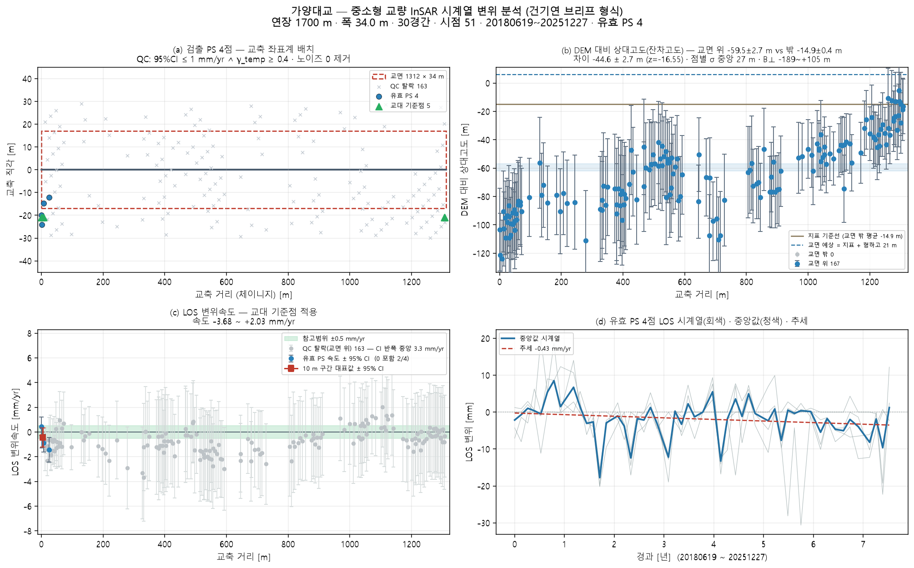
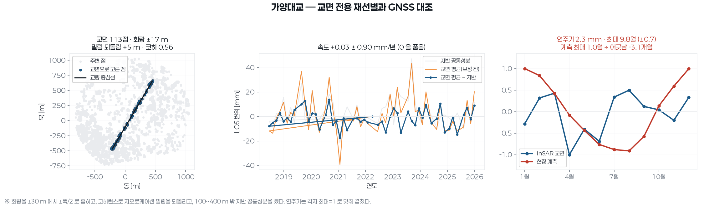

# 가양대교 — 좌표 하나로 끝까지 (bridge_run)

`37.569588, 126.861186` · 트랙 `track_가양대교.h5`

## 무엇을 어디서 가져왔나

| 항목 | 출처 |
|---|---|
| specs | 파트너 실측 CSV '가양대교' (45 m) |
| bridge_type | CSV '강박스거더교(STB)' → box_girder |
| clearance | 전국교량표준데이터 교량높이 21 m |
| deck | 전국교량표준데이터 '가양대교' 시점–종점 선분 1312 m (등록 연장 1700 m · 차이 -23 %) |
| width | 전국교량표준데이터 교량폭 34 m |
| ground | Open-Meteo DEM |
| ground_offset | 처리 오프셋 ≈ 0 (|B| 0.0 m < 3 m · 지면 점 28 · 도로 양쪽 대칭) |
| points | 쉬프트 24.6 m(heading -13.3°) 보정 후 데크 ±30 m 안 167/20000 |
| span_layout | measured — 주경간 180 m(실측)를 가운데, 나머지 29경간 52 m 균등 |

## 제원(적용값)

| 연장 | 경간 | 폭 | 형하고(δh) | 지면 | 데크 방위 | 형식(PINN PDE) | 시점 |
|---|---|---|---|---|---|---|---|
| 1700.0 m | 30 | 34.0 m | 21.0 m | 3.0 m | -120.3° | box_girder · steel | 51 |

## 결과

| | 값 |
|---|---|
| IFC 트윈 | 부재 61 · 점 167 · 결합 167 |
| 잔차고도 | 교면 위 − 밖 -44.6 ± 2.7 m (z=-16.55) — ⚠ '교면 위' 점이 지면보다 유의하게 **낮다**(z<−2) — 교면 산란체가 아닐 수 있다(제방·교대 주변 지면). 평면 선택을 다시 볼 것 |
| PINN · CRI | CRI 0.866 · 위험 |

ⓘ EI·고유진동수는 관측값이 아니라 **설계 제원(기하 EI) 기반** — InSAR 는 상대 변위라 절대 강성을 식별할 수 없다(f₁ 1.03Hz 는 물리 범위 안)

## 그림

3D: `twin.viewer.html` (속도) · `twin_cri.viewer.html` (CRI) — 더블클릭

## 적어 둘 것

- CRI 등급은 **잠정** — 관측조건이 기준치 학습 조건과 다르다(노이즈 23.6mm vs 기준 10.0mm(2.4배) · 관측기간 2748d vs 기준 552d). 등급을 구조 상태로 읽으면 안 된다
- CSV 에 폭 없음 → OSM 보도 간격으로
- OSM 어느 way 도 연장 1700 m 와 안 맞음 (토막난 way) → 표준데이터 시점–종점 선분 사용
- ⚠ '교면 위' 점이 지면보다 유의하게 **낮다**(z<−2) — 교면 산란체가 아닐 수 있다(제방·교대 주변 지면). 평면 선택을 다시 볼 것

## 이 파이프라인이 원리상 못 하는 것 (모든 교량 공통)

- **EI(강성) 관측 식별** — InSAR 는 상대 변위라 자중 처짐을 못 본다. EI·f₁ 은 설계 제원 기반이다(감사 ⓘ).
- **데크 위 PS 밀도** — Sentinel-1 화소 ~11 m. 프로그램으로 늘릴 수 없다. 고해상도 SAR·코너리플렉터가 답이다.
- **쉬프트 방향(각도)** — 궤도 heading 이 정한다. 크기 δh 만 잔차고도로 관측값이 된다.
- **쉬프트의 세 층** — A 기하(δh/tanθ, 보정) · B 처리 오프셋(지면 점 vs OSM 도로선으로 추정, 유의하면 제거) · C 산란체 위치(보도·난간 — 쉬프트가 아님). B 는 OSM 기준 상대값이라 3~5 m 아래는 못 본다.
- **시점 수** — 속도 95 % CI 는 시점 수와 기간이 정한다(51시점). 브리프 기준(≥100장)에 못 미치면 판정을 보류한다.

## 교면 전용 재선별

기존 선별은 교량 중심선 **±30 m** 였다 — 교량 폭보다 넓어 강변 지반이 섞였다.
여기서는 회랑을 **±폭/2** 로 좁히고, 코히런스로 지오로케이션 밀림을 되돌리고,
100~400 m 밖 지반 공통성분을 뺐다.

| 항목 | 값 |
|---|---|
| 교면 회랑 | ±17 m |
| 밀림 되돌림 | +5 m |
| 교면 점 · 평균 코히런스 | 113점 · 0.560 |
| 지반 기준 점 | 1601점 (100~400 m) |
| 속도(지반 보정 후) | +0.03 ± 0.90 mm/년 — 95% 구간이 0 을 품는다 |
| 연주기 | 진폭 2.3 ± 0.7 mm · 최대 9.8월 ± 0.7 |

## MT-InSAR 로 재도출

교면 PS 만 골라(밀림 되돌림 · 회랑 ±폭/2 · γ 문턱) APS 를 뺀 LOS 로 트윈·PINN·
FRAM 을 다시 돌렸다. 아래 값이 현재 유효한 값이다 — 위쪽 본문의 ±30 m 선별 값은
강변 지반이 섞인 옛 값이다.

| 항목 | 값 |
|---|---|
| 교면 PS | 12점 (γ≥0.25 · 회랑 ±17 m · 밀림 +5 m) |
| 평균 코히런스 | 0.560 |
| IFC 결합 | 부재 61 · 결합 12 |
| 속도 중앙값 | 0.53 mm/년 |
| CRI | 점별 중앙 0.128 · 최대 0.22 · 전역 0.799 (경고) |
| 열팽창(교면) | +0.460 mm/°C |

3D: `twin.viewer.html`(속도) · `twin_cri.viewer.html`(CRI) — 더블클릭
