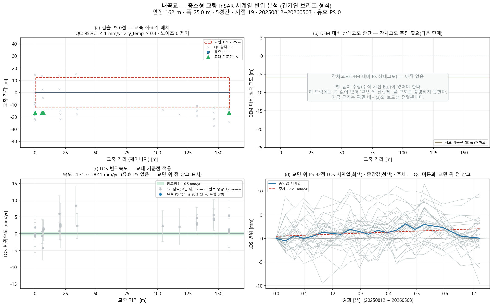

# 내곡교 — 좌표 하나로 끝까지 (bridge_run)

`37.746953, 128.887733` · 트랙 `naegok_track_asc.h5`

## 무엇을 어디서 가져왔나

| 항목 | 출처 |
|---|---|
| specs | 파트너 실측 CSV '내곡교' (0 m) |
| deck_match | CSV 연장 162 m 에 맞는 way 선택(2후보 중) |
| deck | OSM 'way/185200716' 159 m · 방위 -78.3° |
| ground | Open-Meteo DEM |
| points | 쉬프트 7.0 m(heading -13.3°) 보정 후 데크 ±30 m 안 32/52886 |

## 제원(적용값)

| 연장 | 경간 | 폭 | 형하고(δh) | 지면 | 데크 방위 |
|---|---|---|---|---|---|
| 162 m | 5 | 25.0 m | 6.0 m | 13.0 m | -78.3° |

## 결과

| | 값 |
|---|---|
| IFC 트윈 | 부재 11 · 점 32 · 결합 21 |
| 잔차고도 | 없음(SNAP star 산출물 필요) |
| PINN · CRI | CRI 0.798 · 경고 |
| 감사 | **보고 가능**  |

ⓘ EI·고유진동수는 관측값이 아니라 **설계 제원(기하 EI) 기반** — InSAR 는 상대 변위라 절대 강성을 식별할 수 없다(f₁ 2.58Hz 는 물리 범위 안)

## 건기연 브리프(2026-08-26) 내곡교와 비교 — 같은 교량

| | 브리프 | 우리 (이 실행) |
|---|---|---|
| 제원 | 1993 · 162 × 25 m · 높이 7.5 m | CSV 162 m · 폭 25 m(CSV) · 형하고 6 m 가정 |
| 영상 | Sentinel-1 **148장** · 2018.06 ~ 2025.12 (7.5년) | **19장** · 2025.08 ~ 2026.05 (**0.7년**) |
| 교량 상단 PS | 35 | **32** (데크 ±30 m, 쉬프트 7.0 m 보정 후) |
| PS 간격 | 교축 ~13 m 규칙(방위 격자) | 동일 양상 — (a) 참조 |
| 속도 CI | 오차막대 모두 0 포함 → 변형 없음 | CI 반폭 **3.7 mm/yr** — 판정 불가 |
| 잔차고도 (b) | 5~8 m 고르게(교량고 7.5 m) | 없음 — SARvey 트랙에 B⊥ 없음 |
| 결론 | 추세 0.00 mm/yr · 변형 없음 | **판정 보류** — 시점 부족 |

PS 수(32 vs 35)와 격자 양상은 재현됐다. 갈리는 것은 **시간축**이다. 브리프는 7.5년
148장이고 우리는 0.7년 19장이라 속도 95 % CI 가 브리프 기준(1.0 mm/yr)의 3.7배다.
같은 교량·같은 방법에서 결론이 다른 이유는 방법이 아니라 **영상 수**다.

`E:/SLC_RAW/naegok_track54/` 에 **2018.06~2026.08 원시 174장(Level-0 RAW)** 이 있다.
브리프와 같은 기간이다. 이걸 SLC 로 포커싱해 SARvey 를 다시 돌리면 직접 비교가 된다 —
그것이 내곡교의 다음 단계다.

## 그림

3D: `twin.viewer.html` (속도) · `twin_cri.viewer.html` (CRI) — 더블클릭

## 적어 둘 것

- 경간수 없음 → 30 m 규칙으로 5 가정
- 형하고 6.0 m 가정(표준데이터 교량높이 없음) — 잔차고도로 대체 시도
- SNAP star 처리 폴더 없음 → 잔차고도 불가(브리프 (b) 비움)
