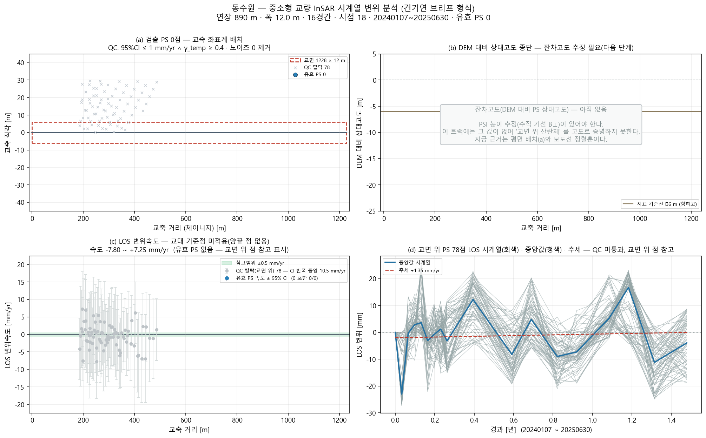

# 동수원 — 좌표 하나로 끝까지 (bridge_run)

`37.27754, 127.02956` · 트랙 `dongsuwon_track.h5`

## 무엇을 어디서 가져왔나

| 항목 | 출처 |
|---|---|
| specs | 파트너 실측 CSV '동수원고가차도' (113 m) |
| deck | OSM '동수원고가차도' 1227 m · 방위 86.8° |
| ground | Open-Meteo DEM |
| points | 쉬프트 6.9 m(heading -13.1°) 보정 후 데크 ±30 m 안 78/454 |

## 제원(적용값)

| 연장 | 경간 | 폭 | 형하고(δh) | 지면 | 데크 방위 |
|---|---|---|---|---|---|
| 890 m | 16 | 12.0 m | 6.0 m | 57.0 m | 86.8° |

## 결과

| | 값 |
|---|---|
| IFC 트윈 | 부재 33 · 점 78 · 결합 58 |
| 잔차고도 | 없음(SNAP star 산출물 필요) |
| PINN · CRI | CRI 0.681 · 정상 |
| 감사 | **보고 불가** · 대상 교량 30m 내 0점(최근접 165.0m) |

ⓘ EI·고유진동수는 관측값이 아니라 **설계 제원(기하 EI) 기반** — InSAR 는 상대 변위라 절대 강성을 식별할 수 없다(f₁ 1.07Hz 는 물리 범위 안)

## 그림

3D: `twin.viewer.html` (속도) · `twin_cri.viewer.html` (CRI) — 더블클릭

## 적어 둘 것

- CSV 에 폭 없음 → OSM 보도 간격으로
- OSM 어느 way 도 CSV 연장 890 m 와 안 맞음 — '동수원고가차도' 1227 m 사용
- 폭 정보 없음 → 12 m 가정
- 형하고 6.0 m 가정(표준데이터 교량높이 없음) — 잔차고도로 대체 시도
- SNAP star 처리 폴더 없음 → 잔차고도 불가(브리프 (b) 비움)
