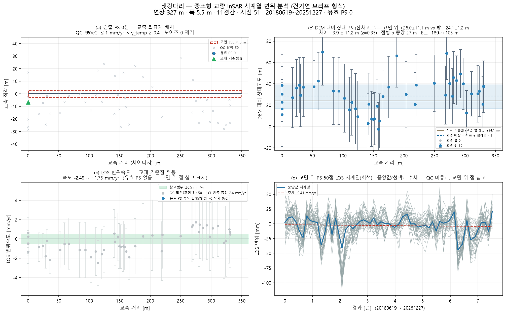
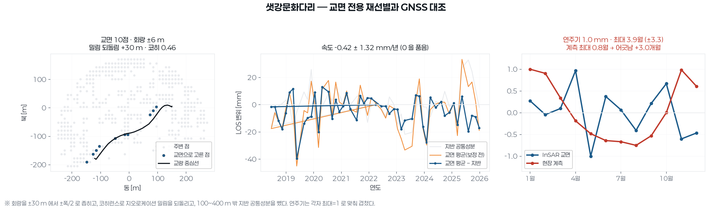
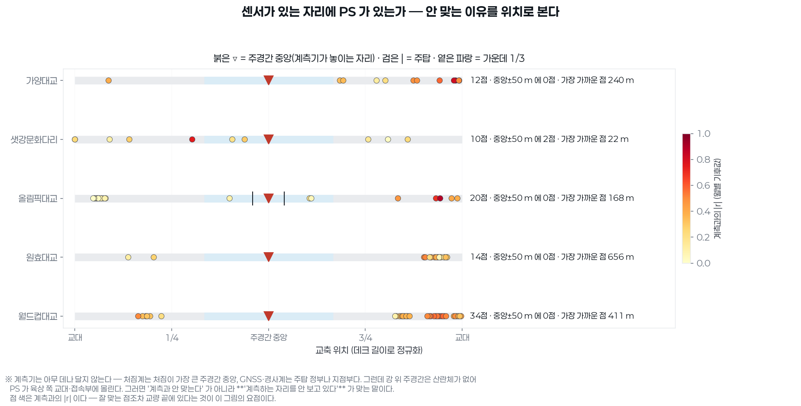

# 샛강다리 — 좌표 하나로 끝까지 (bridge_run)

`37.5187, 126.9186` · 트랙 `track_샛강문화다리.h5`

## 무엇을 어디서 가져왔나

| 항목 | 출처 |
|---|---|
| deck | 배치 파일에 지정한 데크선 |
| deck_cut | 닫힌 way → 주축 양 끝 절단 · 한쪽 차도 23점 |
| width | 전국교량표준데이터 교량폭 5.5 m |
| ground | Open-Meteo DEM |
| ground_offset | 처리 오프셋 ≈ 0 (|B| 0.7 m < 3 m · 지면 점 1029 · 도로 양쪽 대칭) |
| points | 쉬프트 7.0 m(heading -13.3°) 보정 후 데크 ±30 m 안 50/7058 |
| span_layout | equal — 최대경간장 실측이 없어 등간격 |

## 제원(적용값)

| 연장 | 경간 | 폭 | 형하고(δh) | 지면 | 데크 방위 | 형식(PINN PDE) | 시점 |
|---|---|---|---|---|---|---|---|
| 327.4 m | 11 | 5.5 m | 6.0 m | 8.0 m | 34.3° | girder · ? | 51 |

## 결과

| | 값 |
|---|---|
| IFC 트윈 | 부재 23 · 점 50 · 결합 47 |
| 잔차고도 | 교면 위 − 밖 -2.2 ± 12.0 m (z=-0.19) — 고도 차이를 유의하게 확인하지 못함(|z|≤2) — 감도 부족 또는 차이 없음 |
| PINN · CRI | CRI 0.907 · 위험 |
| 감사 | **조건부** · CRI 등급은 **잠정** — 관측조건이 기준치 학습 조건과 다르다(노이즈 21.4mm vs 기준 10.0mm(2.1배) · 관측기간 2748d vs 기준 552d). 등급을 구조 상태로 읽으면 안 된다 |

ⓘ EI·고유진동수는 관측값이 아니라 **설계 제원(기하 EI) 기반** — InSAR 는 상대 변위라 절대 강성을 식별할 수 없다(f₁ 1.58Hz 는 물리 범위 안)

## 그림

3D: `twin.viewer.html` (속도) · `twin_cri.viewer.html` (CRI) — 더블클릭

## 적어 둘 것

- 제원 CSV 에 없음 → OSM 연장으로
- 스택 시작(2018)이 준공(2019)보다 이르다 — 다리가 없던 영상과의 결맞음으로 PS 를 고르면 교면이 통째로 탈락한다. 교면 점이 적으면 scripts/rebuild_track.py --since 2019-01-01 로 트랙을 다시 쌓을 것
- 데크선을 직접 받았다(46점) — OSM 조회를 건너뛴다
- OSM way 가 양방향 차도를 도는 닫힌 선이었다(첫점=끝점) — 주축 양 끝으로 한쪽 차도만 남겨 방위 34.3° · 연장 327 m 로 잡는다
- OSM 보도 간격 55.7 m 는 등록 교량폭 5.5 m 와 크게 달라 쓰지 않았다(그 교량 보도가 아닐 수 있다)
- 경간수 없음 → 30 m 규칙으로 11 가정
- 형하고 6.0 m 가정(표준데이터 교량높이 없음) — 잔차고도로 대체 시도
- 처리 오프셋 ≈ 0 → 교량 위 점의 횡방향 치우침은 산란체 위치(보도·난간)로 본다

## 이 파이프라인이 원리상 못 하는 것 (모든 교량 공통)

- **EI(강성) 관측 식별** — InSAR 는 상대 변위라 자중 처짐을 못 본다. EI·f₁ 은 설계 제원 기반이다(감사 ⓘ).
- **데크 위 PS 밀도** — Sentinel-1 화소 ~11 m. 프로그램으로 늘릴 수 없다. 고해상도 SAR·코너리플렉터가 답이다.
- **쉬프트 방향(각도)** — 궤도 heading 이 정한다. 크기 δh 만 잔차고도로 관측값이 된다.
- **쉬프트의 세 층** — A 기하(δh/tanθ, 보정) · B 처리 오프셋(지면 점 vs OSM 도로선으로 추정, 유의하면 제거) · C 산란체 위치(보도·난간 — 쉬프트가 아님). B 는 OSM 기준 상대값이라 3~5 m 아래는 못 본다.
- **시점 수** — 속도 95 % CI 는 시점 수와 기간이 정한다(51시점). 브리프 기준(≥100장)에 못 미치면 판정을 보류한다.

## 교면 전용 재선별

기존 선별은 교량 중심선 **±30 m** 였다 — 교량 폭보다 넓어 강변 지반이 섞였다.
여기서는 회랑을 **±폭/2** 로 좁히고, 코히런스로 지오로케이션 밀림을 되돌리고,
100~400 m 밖 지반 공통성분을 뺐다.

| 항목 | 값 |
|---|---|
| 교면 회랑 | ±6 m |
| 밀림 되돌림 | +30 m |
| 교면 점 · 평균 코히런스 | 10점 · 0.458 |
| 지반 기준 점 | 202점 (100~400 m) |
| 속도(지반 보정 후) | -0.42 ± 1.32 mm/년 — 95% 구간이 0 을 품는다 |
| 연주기 | 진폭 1.0 ± 1.1 mm · 최대 3.9월 ± 3.3 |
| 보고서 GNSS | 진폭 5.8 mm · 최대 0.8월 (센서 3개) |
| **대조** | 연주기 위상 **+3.0개월** 어긋남 — 같은 거동으로 보기 어렵다 |

## MT-InSAR 로 재도출

교면 PS 만 골라(밀림 되돌림 · 회랑 ±폭/2 · γ 문턱) APS 를 뺀 LOS 로 트윈·PINN·
FRAM 을 다시 돌렸다. 아래 값이 현재 유효한 값이다 — 위쪽 본문의 ±30 m 선별 값은
강변 지반이 섞인 옛 값이다.

| 항목 | 값 |
|---|---|
| 교면 PS | 10점 (γ≥0.00 · 회랑 ±6 m · 밀림 +30 m) |
| 평균 코히런스 | 0.458 |
| IFC 결합 | 부재 23 · 결합 10 |
| 속도 중앙값 | 0.28 mm/년 |
| CRI | 점별 중앙 0.149 · 최대 0.203 · 전역 0.909 (위험) |
| 열팽창(교면) | +0.103 mm/°C |
| 계측 대조 | 연직변위 (P1_U) · 18개월 (자동판독) |
| R² | 0.12 — 우연 기준선 0.23 → 못 넘는다 |
| 추세 | InSAR +2.04±6.14 mm/년 · 계측 -0.44±2.74 → 신뢰구간이 겹친다(다르다고 말할 수 없다) |
| 연주기 | 위상차 -5.1개월 · 진폭 InSAR 4.2 mm / 계측 5.7 |

3D: `twin.viewer.html`(속도) · `twin_cri.viewer.html`(CRI) — 더블클릭

## GNSS 대조 판정

계측기는 주경간 중앙(처짐계)·주탑 정부(GNSS·경사계)에 있다. 강 위 주경간은
산란체가 없어 PS 가 육상 쪽 교대·접속부에만 잡히므로, 낮은 R² 는 '계측과
어긋난다' 가 아니라 **'계측하는 자리를 안 봤다'** 로 읽어야 한다.

| 항목 | 값 |
|---|---|
| **판정** | **계측 지점에서 PS 도출 못함** |
| 근거 | R² 0.560 < 0.80 — 계측 지점(주경간 중앙) ±50 m 안에 PS 가 2점이고 가장 가까운 점이 22 m 떨어져 있다 |
| R²(교면 PS 최대) | 0.560 · 우연 기준선 0.550 |
| 계측 지점 PS | 주경간 중앙 ±50 m 안 2점 · 가장 가까운 점 22 m |
| PS 측점 분포 | [0.0, 35.7, 123.7, 236.4, 299.8] m (데크 349 m) |

