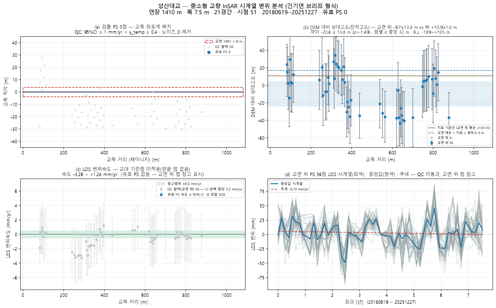

# 성산대교 — 좌표 하나로 끝까지 (bridge_run)

`37.552057, 126.891156` · 트랙 `track_성산대교.h5`

## 무엇을 어디서 가져왔나

| 항목 | 출처 |
|---|---|
| specs | 파트너 실측 CSV '성산대교' (34 m) |
| bridge_type | CSV '게르바교(GER)' → girder |
| deck_match | CSV 연장 1410 m 에 맞는 '성산대교' way 선택(4후보 중) |
| deck | OSM '성산대교' 1079 m · 방위 64.4° |
| width | 전국교량표준데이터 교량폭 7.5 m |
| ground | Open-Meteo DEM |
| ground_offset | 처리 오프셋 ≈ 0 (|B| 0.0 m < 3 m · 지면 점 100 · 도로 양쪽 대칭) |
| points | 쉬프트 7.0 m(heading -13.3°) 보정 후 데크 ±30 m 안 56/20000 |
| span_layout | measured — 주경간 120 m(실측)를 가운데, 나머지 20경간 64 m 균등 |

## 제원(적용값)

| 연장 | 경간 | 폭 | 형하고(δh) | 지면 | 데크 방위 | 형식(PINN PDE) | 시점 |
|---|---|---|---|---|---|---|---|
| 1410.0 m | 21 | 7.5 m | 6.0 m | 3.0 m | 64.4° | girder · steel | 51 |

## 결과

| | 값 |
|---|---|
| IFC 트윈 | 부재 43 · 점 56 · 결합 56 |
| 잔차고도 | 교면 위 − 밖 -20.6 ± 13.8 m (z=-1.49) — 고도 차이를 유의하게 확인하지 못함(|z|≤2) — 감도 부족 또는 차이 없음 |
| PINN · CRI | CRI 0.872 · 위험 |
| 감사 | **조건부** · 표준데이터에 이 교량이 없다(최근접 '월드컵대교 남단연결로 RAMP-A교' 518m). PINN 은 파트너 실측 CSV '성산대교' (34 m) 제원(경간 1410m)을 썼다 — 실 제원 확인 필요(--bridge-profile) · CRI 등급은 **잠정** — 관측조건이 기준치 학습 조건과 다르다(노이즈 24.7mm vs 기준 10.0mm(2.5배) · 관측기간 2748d vs 기준 552d). 등급을 구조 상태로 읽으면 안 된다 |

ⓘ EI·고유진동수는 관측값이 아니라 **설계 제원(기하 EI) 기반** — InSAR 는 상대 변위라 절대 강성을 식별할 수 없다(f₁ 0.47Hz 는 물리 범위 안)

## 그림

3D: `twin.viewer.html` (속도) · `twin_cri.viewer.html` (CRI) — 더블클릭

## 적어 둘 것

- CSV 에 폭 없음 → OSM 보도 간격으로
- OSM 보도 간격 193.5 m 는 등록 교량폭 7.5 m 와 크게 달라 쓰지 않았다(그 교량 보도가 아닐 수 있다)
- 형하고 6.0 m 가정(표준데이터 교량높이 없음) — 잔차고도로 대체 시도
- 처리 오프셋 ≈ 0 → 교량 위 점의 횡방향 치우침은 산란체 위치(보도·난간)로 본다

## 이 파이프라인이 원리상 못 하는 것 (모든 교량 공통)

- **EI(강성) 관측 식별** — InSAR 는 상대 변위라 자중 처짐을 못 본다. EI·f₁ 은 설계 제원 기반이다(감사 ⓘ).
- **데크 위 PS 밀도** — Sentinel-1 화소 ~11 m. 프로그램으로 늘릴 수 없다. 고해상도 SAR·코너리플렉터가 답이다.
- **쉬프트 방향(각도)** — 궤도 heading 이 정한다. 크기 δh 만 잔차고도로 관측값이 된다.
- **쉬프트의 세 층** — A 기하(δh/tanθ, 보정) · B 처리 오프셋(지면 점 vs OSM 도로선으로 추정, 유의하면 제거) · C 산란체 위치(보도·난간 — 쉬프트가 아님). B 는 OSM 기준 상대값이라 3~5 m 아래는 못 본다.
- **시점 수** — 속도 95 % CI 는 시점 수와 기간이 정한다(51시점). 브리프 기준(≥100장)에 못 미치면 판정을 보류한다.
