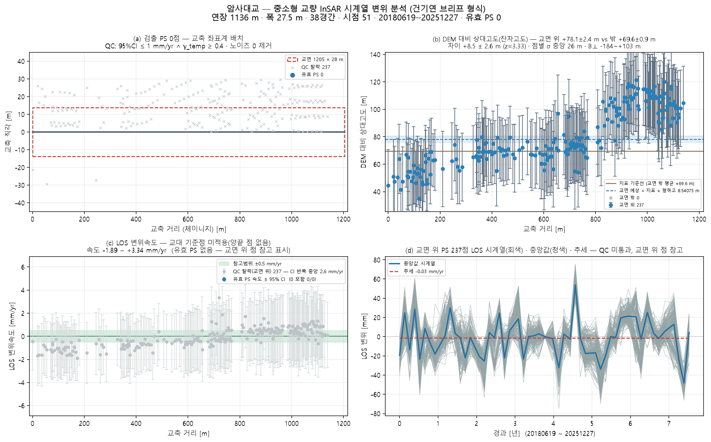

# 암사대교 — 좌표 하나로 끝까지 (bridge_run)

`37.569152, 127.131795` · 트랙 `track_암사대교.h5`

## 무엇을 어디서 가져왔나

| 항목 | 출처 |
|---|---|
| specs | 파트너 실측 CSV '구리암사대교' (576 m) |
| bridge_type | CSV '아치교' → arch |
| clearance | 잔차고도 집단평균 +8.5±2.6 m (z=3.33) |
| deck_cut | 닫힌 way → 주축 양 끝 절단 · 한쪽 차도 26점 |
| deck | OSM '구리암사대교' 2363 m · 방위 125.2° |
| ground | Open-Meteo DEM |
| ground_offset | 처리 오프셋 ≈ 0 (|B| 0.0 m < 3 m · 지면 점 50 · 도로 양쪽 대칭) |
| points | 쉬프트 32.4 m(heading -13.3°) 보정 후 데크 ±30 m 안 237/20000 |

## 제원(적용값)

| 연장 | 경간 | 폭 | 형하고(δh) | 지면 | 데크 방위 | 형식(PINN PDE) | 시점 |
|---|---|---|---|---|---|---|---|
| 1136.1 m | 38 | 27.5 m | 8.5 m | 5.0 m | 125.2° | arch · ? | 51 |

## 결과

| | 값 |
|---|---|
| IFC 트윈 | 부재 77 · 점 237 · 결합 237 |
| 잔차고도 | 교면 위 − 밖 +8.5 ± 2.6 m (z=3.33) — 교면 위 점이 지면 점보다 유의하게 높다(z>2) |
| PINN · CRI | CRI 0.809 · 경고 |
| 감사 | **조건부** · CRI 등급은 **잠정** — 관측조건이 기준치 학습 조건과 다르다(노이즈 20.7mm vs 기준 10.0mm(2.1배) · 관측기간 2748d vs 기준 552d). 등급을 구조 상태로 읽으면 안 된다 |

ⓘ EI·고유진동수는 관측값이 아니라 **설계 제원(기하 EI) 기반** — InSAR 는 상대 변위라 절대 강성을 식별할 수 없다(f₁ 1.75Hz 는 물리 범위 안)

## 그림

3D: `twin.viewer.html` (속도) · `twin_cri.viewer.html` (CRI) — 더블클릭

## 적어 둘 것

- 연장 1133 m 에 맞는 way 는 이름이 없다 — 이름이 맞는 '구리암사대교' 2363 m 를 쓴다
- OSM way 가 양방향 차도를 도는 닫힌 선이었다(첫점=끝점) — 주축 양 끝으로 한쪽 차도만 남겨 방위 125.2° · 연장 1136 m 로 잡는다
- 경간수 없음 → 30 m 규칙으로 38 가정

## 이 파이프라인이 원리상 못 하는 것 (모든 교량 공통)

- **EI(강성) 관측 식별** — InSAR 는 상대 변위라 자중 처짐을 못 본다. EI·f₁ 은 설계 제원 기반이다(감사 ⓘ).
- **데크 위 PS 밀도** — Sentinel-1 화소 ~11 m. 프로그램으로 늘릴 수 없다. 고해상도 SAR·코너리플렉터가 답이다.
- **쉬프트 방향(각도)** — 궤도 heading 이 정한다. 크기 δh 만 잔차고도로 관측값이 된다.
- **쉬프트의 세 층** — A 기하(δh/tanθ, 보정) · B 처리 오프셋(지면 점 vs OSM 도로선으로 추정, 유의하면 제거) · C 산란체 위치(보도·난간 — 쉬프트가 아님). B 는 OSM 기준 상대값이라 3~5 m 아래는 못 본다.
- **시점 수** — 속도 95 % CI 는 시점 수와 기간이 정한다(51시점). 브리프 기준(≥100장)에 못 미치면 판정을 보류한다.
