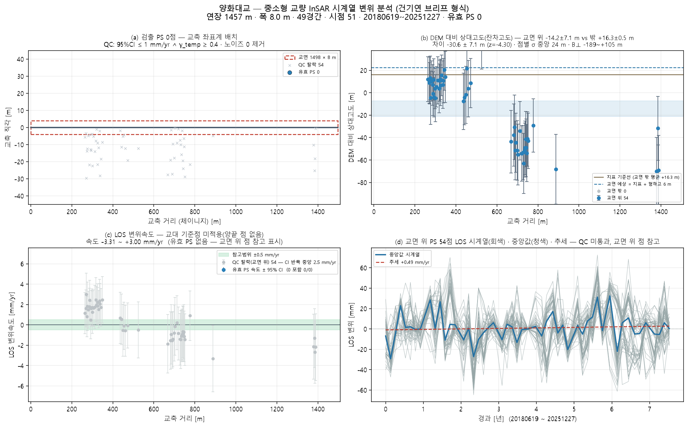
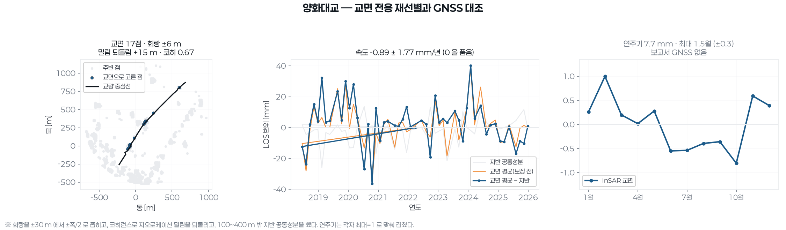

# 양화대교 — 좌표 하나로 끝까지 (bridge_run)

`37.542465, 126.90301` · 트랙 `track_양화대교.h5`

## 무엇을 어디서 가져왔나

| 항목 | 출처 |
|---|---|
| deck_cut | 닫힌 way → 주축 양 끝 절단 · 한쪽 차도 27점 |
| deck | OSM '양화대교' 3058 m · 방위 51.3° |
| width | 전국교량표준데이터 교량폭 8 m |
| ground | Open-Meteo DEM |
| ground_offset | 처리 오프셋 ≈ 0 (|B| 0.0 m < 3 m · 지면 점 19 · 도로 양쪽 대칭) |
| points | 쉬프트 7.0 m(heading -13.3°) 보정 후 데크 ±30 m 안 54/20000 |
| span_layout | equal — 최대경간장 실측이 없어 등간격 |

## 제원(적용값)

| 연장 | 경간 | 폭 | 형하고(δh) | 지면 | 데크 방위 | 형식(PINN PDE) | 시점 |
|---|---|---|---|---|---|---|---|
| 1457.3 m | 49 | 8.0 m | 6.0 m | 13.0 m | 51.3° | girder · ? | 51 |

## 결과

| | 값 |
|---|---|
| IFC 트윈 | 부재 99 · 점 54 · 결합 37 |
| 잔차고도 | 교면 위 − 밖 -30.6 ± 7.1 m (z=-4.30) — ⚠ '교면 위' 점이 지면보다 유의하게 **낮다**(z<−2) — 교면 산란체가 아닐 수 있다(제방·교대 주변 지면). 평면 선택을 다시 볼 것 |
| PINN · CRI | CRI 0.833 · 위험 |
| 감사 | **조건부** · 표준데이터에 이 교량이 없다(최근접 '양화대교북단램프교(F-1)' 671m). PINN 은 osm 제원(경간 1457m)을 썼다 — 실 제원 확인 필요(--bridge-profile) · CRI 등급은 **잠정** — 관측조건이 기준치 학습 조건과 다르다(노이즈 19.0mm vs 기준 10.0mm(1.9배) · 관측기간 2748d vs 기준 552d). 등급을 구조 상태로 읽으면 안 된다 |

ⓘ EI·고유진동수는 관측값이 아니라 **설계 제원(기하 EI) 기반** — InSAR 는 상대 변위라 절대 강성을 식별할 수 없다(f₁ 1.59Hz 는 물리 범위 안)

## 그림

3D: `twin.viewer.html` (속도) · `twin_cri.viewer.html` (CRI) — 더블클릭

## 적어 둘 것

- 제원 CSV 에 없음 → OSM 연장으로
- OSM way 가 양방향 차도를 도는 닫힌 선이었다(첫점=끝점) — 주축 양 끝으로 한쪽 차도만 남겨 방위 51.3° · 연장 1457 m 로 잡는다
- OSM 보도 간격 0.4 m 는 등록 교량폭 8 m 와 크게 달라 쓰지 않았다(그 교량 보도가 아닐 수 있다)
- 경간수 없음 → 30 m 규칙으로 49 가정
- 형하고 6.0 m 가정(표준데이터 교량높이 없음) — 잔차고도로 대체 시도
- ⚠ '교면 위' 점이 지면보다 유의하게 **낮다**(z<−2) — 교면 산란체가 아닐 수 있다(제방·교대 주변 지면). 평면 선택을 다시 볼 것

## 이 파이프라인이 원리상 못 하는 것 (모든 교량 공통)

- **EI(강성) 관측 식별** — InSAR 는 상대 변위라 자중 처짐을 못 본다. EI·f₁ 은 설계 제원 기반이다(감사 ⓘ).
- **데크 위 PS 밀도** — Sentinel-1 화소 ~11 m. 프로그램으로 늘릴 수 없다. 고해상도 SAR·코너리플렉터가 답이다.
- **쉬프트 방향(각도)** — 궤도 heading 이 정한다. 크기 δh 만 잔차고도로 관측값이 된다.
- **쉬프트의 세 층** — A 기하(δh/tanθ, 보정) · B 처리 오프셋(지면 점 vs OSM 도로선으로 추정, 유의하면 제거) · C 산란체 위치(보도·난간 — 쉬프트가 아님). B 는 OSM 기준 상대값이라 3~5 m 아래는 못 본다.
- **시점 수** — 속도 95 % CI 는 시점 수와 기간이 정한다(51시점). 브리프 기준(≥100장)에 못 미치면 판정을 보류한다.

## 교면 전용 재선별

기존 선별은 교량 중심선 **±30 m** 였다 — 교량 폭보다 넓어 강변 지반이 섞였다.
여기서는 회랑을 **±폭/2** 로 좁히고, 코히런스로 지오로케이션 밀림을 되돌리고,
100~400 m 밖 지반 공통성분을 뺐다.

| 항목 | 값 |
|---|---|
| 교면 회랑 | ±6 m |
| 밀림 되돌림 | +15 m |
| 교면 점 · 평균 코히런스 | 17점 · 0.667 |
| 지반 기준 점 | 416점 (100~400 m) |
| 속도(지반 보정 후) | -0.89 ± 1.77 mm/년 — 95% 구간이 0 을 품는다 |
| 연주기 | 진폭 7.7 ± 2.7 mm · 최대 1.5월 ± 0.3 |
| 보고서 GNSS | 없음 — 대조 불가 |

## MT-InSAR 로 재도출

교면 PS 만 골라(밀림 되돌림 · 회랑 ±폭/2 · γ 문턱) APS 를 뺀 LOS 로 트윈·PINN·
FRAM 을 다시 돌렸다. 아래 값이 현재 유효한 값이다 — 위쪽 본문의 ±30 m 선별 값은
강변 지반이 섞인 옛 값이다.

| 항목 | 값 |
|---|---|
| 교면 PS | 17점 (γ≥0.00 · 회랑 ±6 m · 밀림 +15 m) |
| 평균 코히런스 | 0.667 |
| IFC 결합 | 부재 99 · 결합 12 |
| 속도 중앙값 | 0.23 mm/년 |
| CRI | 점별 중앙 0.134 · 최대 0.24 · 전역 0.853 (경고) |
| 열팽창(교면) | -0.117 mm/°C |
| 계측 대조 | 보고서 계측 없음 |

3D: `twin.viewer.html`(속도) · `twin_cri.viewer.html`(CRI) — 더블클릭
