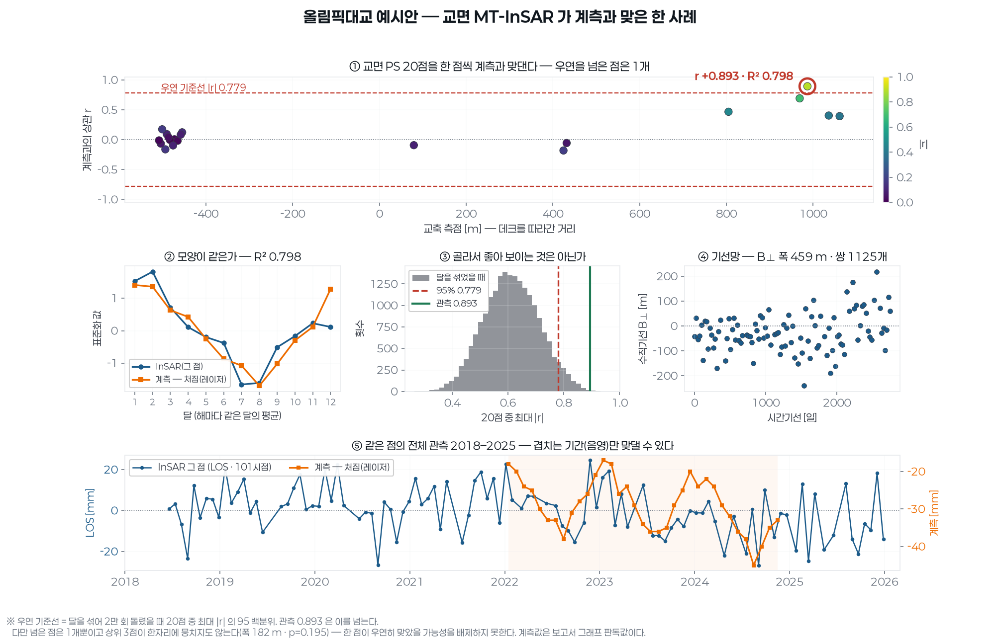

# 올림픽대교 예시안 — 한 교량을 끝까지 펴 본다

계측 곡선이 있는 5개소 중 **교면 PS 가 계측과 가장 잘 맞은 곳**이다. 관측 시점도
101장으로 가장 길다(2018-06 ~ 2025-12).

전 교량 자료에서는 R² 0.80 을 판정선으로 놓아 이 교량이 **0.002 차이로** 아래에
떨어졌다. 그 선은 물리에서 나온 것이 아니라 내가 정한 것이다. **우연 기준선을**
**넘는가**가 더 곧은 잣대이고, 그 잣대로는 넘는다.

## 계측과 맞은 정도

| 항목 | 값 |
|---|---|
| 계측 | 처짐(레이저) (눈으로 읽음) |
| 가장 잘 맞은 점 | r **+0.893** · R² **0.798** (양의 방향 — 계측과 같은 쪽으로 움직인다) |
| 우연 기준선 | \|r\| 0.779 · R² 0.607 → **넘는다** |
| 맞댄 달 | 12개 (해마다 같은 달의 평균끼리) |
| 그 점의 품질 | 코히런스 0.506 · 시간결맞음 γ 0.173 |

## 그대로 믿으면 안 되는 이유 — 같이 적는다

- 교면 PS 가 **20점뿐**이고, 그중 우연 기준선을 넘은 점은 **1개**다.
- 상위 3점이 한자리에 **뭉치지 않는다**(측점 폭 182 m · p=0.195). 같은 거동을 여러 점이 같이 봤다면 뭉쳐야 한다 —
  한 점이 우연히 맞았을 가능성을 배제하지 못한다.
- 점별 상관의 중앙값은 +0.023 이다. 대부분의 점은 계측과 무관하다.
- 계측값은 보고서 그래프를 **눈으로 읽은 값**이다(원자료도, 인쇄된 표도 아니다).

## 같은 자료에서 함께 나오는 것들

| 항목 | 값 |
|---|---|
| 수직기선 B⊥ | -240.2 ~ +218.6 m (폭 459 m) |
| 기선망 | 쌍 1125개 · 연결됨 |
| γ 중앙값(교면) | 0.183 |
| 잔차고도 σΔh | 7.6 m |
| 열팽창(교면) | -0.217 mm/°C |
| 속도 중앙값 | -0.91 mm/년 |
| CRI | 점별 중앙 0.142 · 전역 0.828 (등급 기준은 잠정) |
| IFC 트윈 | 부재 637 · 결합 14 |

3D: `twin.viewer.html`(속도) · `twin_cri.viewer.html`(CRI) — 더블클릭

## 이 예시안이 말하는 것

한 교량에서 **위성만으로 계측과 같은 계절 거동을 집어낸 점이 실제로 있었다**.
그러나 20점 중 1점이고 뭉치지도 않았다. 지금 부족한 것은 방법이 아니라 **교면
측점의 수**다. Sentinel-1 IW 는 지상 5×20 m 이고 데크 폭은 1~2 화소라 교면에
점이 몇 개 안 잡힌다. 주경간에 코너리플렉터를 놓거나 고해상도 SAR 을 쓰면
이 칸이 채워지고, 그때 비로소 '맞는다/안 맞는다' 를 말할 수 있다.
