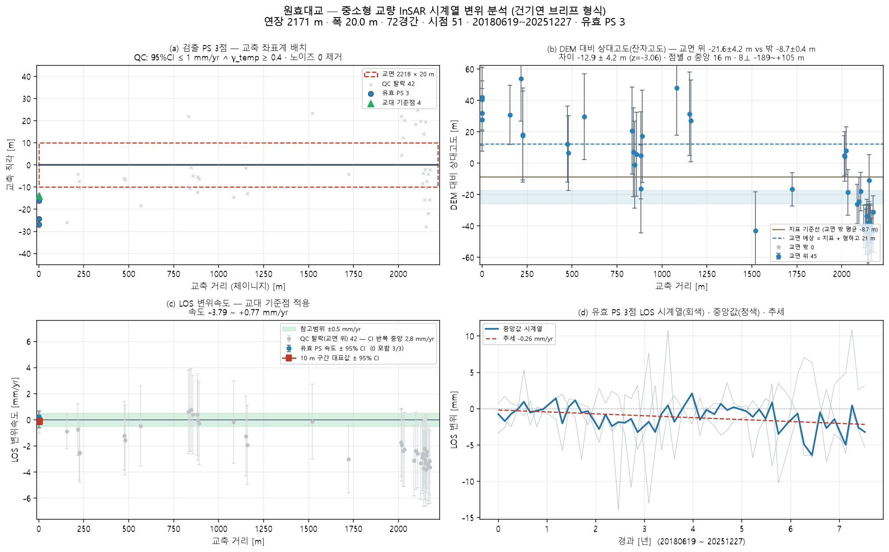
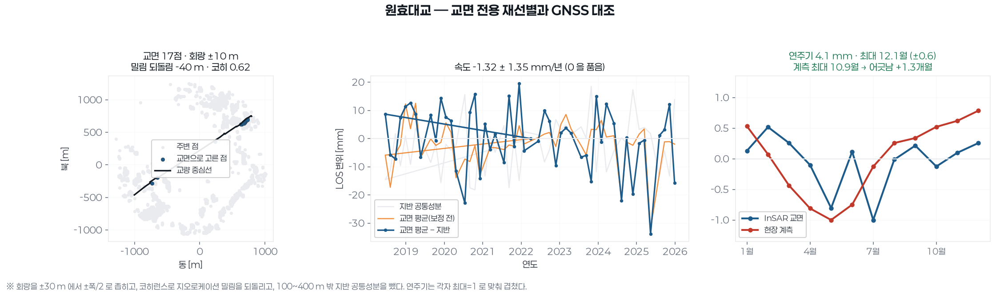
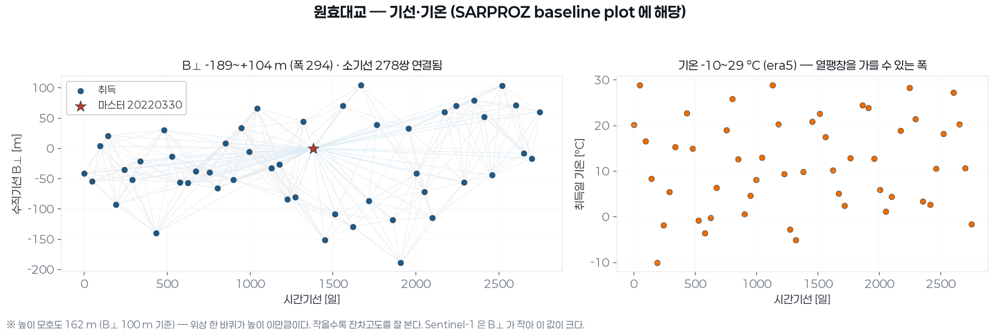

# 원효대교 — 좌표 하나로 끝까지 (bridge_run)

`37.526808, 126.945404` · 트랙 `track_원효대교.h5`

## 무엇을 어디서 가져왔나

| 항목 | 출처 |
|---|---|
| specs | 파트너 실측 CSV '원효대교' (64 m) |
| bridge_type | CSV 'PC박스거더교(PCB)' → box_girder |
| clearance | 전국교량표준데이터 교량높이 21 m |
| deck_cut | 닫힌 way → 주축 양 끝 절단 · 한쪽 차도 29점 |
| deck | OSM '원효대교' 4512 m · 방위 34.1° |
| width | 전국교량표준데이터 교량폭 20 m |
| ground | Open-Meteo DEM |
| ground_offset | 처리 오프셋 ≈ 0 (|B| 0.0 m < 3 m · 지면 점 27 · 도로 양쪽 대칭) |
| points | 쉬프트 24.3 m(heading -13.3°) 보정 후 데크 ±30 m 안 45/20000 |
| span_layout | measured — 주경간 100 m(실측)를 가운데, 나머지 71경간 29 m 균등 |

## 제원(적용값)

| 연장 | 경간 | 폭 | 형하고(δh) | 지면 | 데크 방위 | 형식(PINN PDE) | 시점 |
|---|---|---|---|---|---|---|---|
| 2171.3 m | 72 | 20.0 m | 21.0 m | 3.0 m | 34.1° | box_girder · prestressed_concrete | 51 |

## 결과

| | 값 |
|---|---|
| IFC 트윈 | 부재 145 · 점 45 · 결합 44 |
| 잔차고도 | 교면 위 − 밖 -12.9 ± 4.2 m (z=-3.06) — ⚠ '교면 위' 점이 지면보다 유의하게 **낮다**(z<−2) — 교면 산란체가 아닐 수 있다(제방·교대 주변 지면). 평면 선택을 다시 볼 것 |
| PINN · CRI | CRI 0.832 · 위험 |

ⓘ EI·고유진동수는 관측값이 아니라 **설계 제원(기하 EI) 기반** — InSAR 는 상대 변위라 절대 강성을 식별할 수 없다(f₁ 1.01Hz 는 물리 범위 안)

## 그림

3D: `twin.viewer.html` (속도) · `twin_cri.viewer.html` (CRI) — 더블클릭

## 적어 둘 것

- 대상 교량 30m 내 0점(최근접 54.3m) · CRI 등급은 **잠정** — 관측조건이 기준치 학습 조건과 다르다(관측기간 2748d vs 기준 552d). 등급을 구조 상태로 읽으면 안 된다
- CSV 에 폭 없음 → OSM 보도 간격으로
- 연장 2064 m 에 맞는 way 는 이름이 없다 — 이름이 맞는 '원효대교' 4512 m 를 쓴다
- OSM way 가 양방향 차도를 도는 닫힌 선이었다(첫점=끝점) — 주축 양 끝으로 한쪽 차도만 남겨 방위 34.1° · 연장 2171 m 로 잡는다
- 경간수 없음 → 30 m 규칙으로 72 가정
- ⚠ '교면 위' 점이 지면보다 유의하게 **낮다**(z<−2) — 교면 산란체가 아닐 수 있다(제방·교대 주변 지면). 평면 선택을 다시 볼 것

## 이 파이프라인이 원리상 못 하는 것 (모든 교량 공통)

- **EI(강성) 관측 식별** — InSAR 는 상대 변위라 자중 처짐을 못 본다. EI·f₁ 은 설계 제원 기반이다(감사 ⓘ).
- **데크 위 PS 밀도** — Sentinel-1 화소 ~11 m. 프로그램으로 늘릴 수 없다. 고해상도 SAR·코너리플렉터가 답이다.
- **쉬프트 방향(각도)** — 궤도 heading 이 정한다. 크기 δh 만 잔차고도로 관측값이 된다.
- **쉬프트의 세 층** — A 기하(δh/tanθ, 보정) · B 처리 오프셋(지면 점 vs OSM 도로선으로 추정, 유의하면 제거) · C 산란체 위치(보도·난간 — 쉬프트가 아님). B 는 OSM 기준 상대값이라 3~5 m 아래는 못 본다.
- **시점 수** — 속도 95 % CI 는 시점 수와 기간이 정한다(51시점). 브리프 기준(≥100장)에 못 미치면 판정을 보류한다.

## 교면 전용 재선별

기존 선별은 교량 중심선 **±30 m** 였다 — 교량 폭보다 넓어 강변 지반이 섞였다.
여기서는 회랑을 **±폭/2** 로 좁히고, 코히런스로 지오로케이션 밀림을 되돌리고,
100~400 m 밖 지반 공통성분을 뺐다.

| 항목 | 값 |
|---|---|
| 교면 회랑 | ±10 m |
| 밀림 되돌림 | -40 m  ⚠ 훑은 범위의 끝이라 봉우리를 못 찾았다 — 믿을 값이 아니다 |
| 교면 점 · 평균 코히런스 | 17점 · 0.625 |
| 지반 기준 점 | 601점 (100~400 m) |
| 속도(지반 보정 후) | -1.32 ± 1.35 mm/년 — 95% 구간이 0 을 품는다 |
| 연주기 | 진폭 4.1 ± 1.2 mm · 최대 12.1월 ± 0.6 |

## MT-InSAR 로 재도출

교면 PS 만 골라(밀림 되돌림 · 회랑 ±폭/2 · γ 문턱) APS 를 뺀 LOS 로 트윈·PINN·
FRAM 을 다시 돌렸다. 아래 값이 현재 유효한 값이다 — 위쪽 본문의 ±30 m 선별 값은
강변 지반이 섞인 옛 값이다.

| 항목 | 값 |
|---|---|
| 교면 PS | 14점 (γ≥0.25 · 회랑 ±10 m · 밀림 -40 m) |
| 평균 코히런스 | 0.625 |
| IFC 결합 | 부재 145 · 결합 14 |
| 속도 중앙값 | -0.53 mm/년 |
| CRI | 점별 중앙 0.087 · 최대 0.19 · 전역 0.772 (경고) |
| 열팽창(교면) | -0.429 mm/°C |

3D: `twin.viewer.html`(속도) · `twin_cri.viewer.html`(CRI) — 더블클릭

## 기선망과 시간결맞음

점마다 `los = c + v·t + K·Δh (+ α·ΔT)` 를 같이 푼다. K 는 수직기선이 정하므로
**기선이 얼마나 벌어져 있는지가 잔차고도를 가를 수 있는지를 정한다.** γ 는 그 모형이
그 점을 얼마나 설명하는지이고, 값보다 **어디 있는 점이 살아남았는지**가 중요하다.

| 항목 | 값 |
|---|---|
| 처리 사슬 | SNAP |
| 시점 · 마스터 | 51시점 · 20220330 |
| 수직기선 B⊥ | -189.0 ~ +104.5 m (폭 294 m · σ 68.7 m) |
| 시간기선 | 2748 일 |
| 기선망 | 쌍 278개 · 차수 최소 6 · 평균 10.9 · **연결됨** (문턱 B⊥ ≤ 150 m · Bt ≤ 400 일) |
| 높이 모호성 | B⊥=100 m 에서 162 m |
| **γ 중앙값** | **0.313** (문턱 0.35 → 874/1943점 통과 (45 %)) |
| γ 통과 점이 어디 있나 | 교량 위(0~10 m) 8/19점 · 먼 맨땅(100~200 m) 195점 |
| 잔차고도 σΔh | 11.4 m — 형하고(8~25 m)보다 작다: 높이로 가려낼 여지가 있다 |
| APS 제거량 | RMS 1.80 mm · 잔차 14.0 → 10.6 mm |

시점별 B⊥·시간기선은 `mtinsar_baselines.csv`, 점별 속도·Δh·열팽창·γ 는
`mtinsar_points.csv` 에 있다(SARPROZ 가 내는 표와 같은 꼴).
