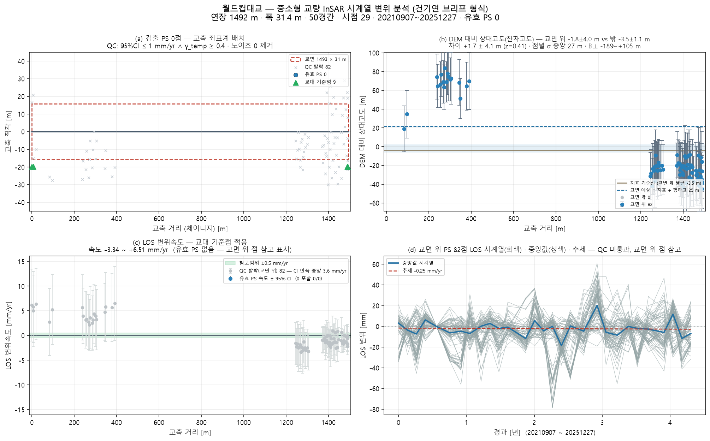

# 월드컵대교 — 좌표 하나로 끝까지 (bridge_run)

`37.556493, 126.885528` · 트랙 `track_월드컵대교_2021.h5`

## 무엇을 어디서 가져왔나

| 항목 | 출처 |
|---|---|
| specs | 파트너 실측 CSV '월드컵대교 주경간교' (404 m) |
| bridge_type | CSV '사장교' → cable_stayed |
| clearance | 전국교량표준데이터 교량높이 25 m |
| deck_match | CSV 연장 855 m 에 맞는 '월드컵대교' way 선택(4후보 중) |
| deck_whole | 토막 1023 m → 포함 way 1492 m · 연장을 데크선에 맞춘다 |
| deck | OSM '월드컵대교' 1492 m · 방위 69.4° |
| ground | Open-Meteo DEM |
| ground_offset | 처리 오프셋 ≈ 0 (|B| 0.0 m < 3 m · 지면 점 55 · 도로 양쪽 대칭) |
| points | 쉬프트 29.2 m(heading -13.3°) 보정 후 데크 ±30 m 안 82/20000 |
| span_layout | equal — 최대경간장 실측이 없어 등간격 |

## 제원(적용값)

| 연장 | 경간 | 폭 | 형하고(δh) | 지면 | 데크 방위 | 형식(PINN PDE) | 시점 |
|---|---|---|---|---|---|---|---|
| 1491.7 m | 50 | 31.4 m | 25.0 m | 3.0 m | 69.4° | cable_stayed · ? | 29 |

## 결과

| | 값 |
|---|---|
| IFC 트윈 | 부재 101 · 점 82 · 결합 72 |
| 잔차고도 | 교면 위 − 밖 +1.7 ± 4.1 m (z=0.41) — 고도 차이를 유의하게 확인하지 못함(|z|≤2) — 감도 부족 또는 차이 없음 |
| PINN · CRI | CRI 0.929 · 위험 |
| 감사 | **보고 불가** · 대상 교량 30m 내 0점(최근접 342.6m) · CRI 등급은 **잠정** — 관측조건이 기준치 학습 조건과 다르다(노이즈 17.6mm vs 기준 10.0mm(1.8배)). 등급을 구조 상태로 읽으면 안 된다 |

ⓘ EI·고유진동수는 관측값이 아니라 **설계 제원(기하 EI) 기반** — InSAR 는 상대 변위라 절대 강성을 식별할 수 없다(f₁ 1.90Hz 는 물리 범위 안)

## 그림

3D: `twin.viewer.html` (속도) · `twin_cri.viewer.html` (CRI) — 더블클릭

## 적어 둘 것

- OSM way 가 토막나 있다 — 고른 '월드컵대교' 1023 m 를 통째로 품는 1492 m way 가 있어 데크 전체로 넓힌다 (연장도 그 값으로 — CSV 855 m 는 주경간만이다)
- 경간수 없음 → 30 m 규칙으로 50 가정

## 이 파이프라인이 원리상 못 하는 것 (모든 교량 공통)

- **EI(강성) 관측 식별** — InSAR 는 상대 변위라 자중 처짐을 못 본다. EI·f₁ 은 설계 제원 기반이다(감사 ⓘ).
- **데크 위 PS 밀도** — Sentinel-1 화소 ~11 m. 프로그램으로 늘릴 수 없다. 고해상도 SAR·코너리플렉터가 답이다.
- **쉬프트 방향(각도)** — 궤도 heading 이 정한다. 크기 δh 만 잔차고도로 관측값이 된다.
- **쉬프트의 세 층** — A 기하(δh/tanθ, 보정) · B 처리 오프셋(지면 점 vs OSM 도로선으로 추정, 유의하면 제거) · C 산란체 위치(보도·난간 — 쉬프트가 아님). B 는 OSM 기준 상대값이라 3~5 m 아래는 못 본다.
- **시점 수** — 속도 95 % CI 는 시점 수와 기간이 정한다(29시점). 브리프 기준(≥100장)에 못 미치면 판정을 보류한다.
