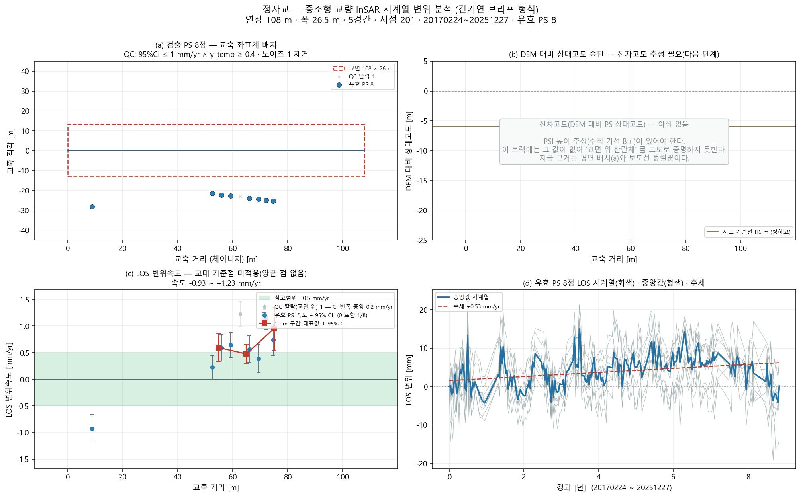

# 정자교 — 좌표 하나로 끝까지 (bridge_run)

`37.3685405, 127.1089983` · 트랙 `sarvey_permissive.h5`

## 무엇을 어디서 가져왔나

| 항목 | 출처 |
|---|---|
| specs | 파트너 실측 CSV '정자교' (8 m) |
| deck_match | CSV 연장 108 m 에 맞는 way 선택(4후보 중) |
| deck | OSM 'way/1229714817' 108 m · 방위 180.0° |
| width | OSM 보도 간격 23.5 m + 보도 반폭 |
| ground | Open-Meteo DEM |
| points | 쉬프트 6.8 m(heading -13.2°) 보정 후 데크 ±30 m 안 9/2661 |

## 제원(적용값)

| 연장 | 경간 | 폭 | 형하고(δh) | 지면 | 데크 방위 |
|---|---|---|---|---|---|
| 108 m | 5 | 26.5 m | 6.0 m | 39.0 m | 180.0° |

## 결과

| | 값 |
|---|---|
| IFC 트윈 | 부재 11 · 점 9 · 결합 9 |
| 잔차고도 | 없음(SNAP star 산출물 필요) |
| PINN · CRI | CRI 0.519 · 정상 |
| 감사 | **조건부** · 표준데이터에 이 교량이 없다(최근접 '금곡교' 565m). PINN 은 파트너 실측 CSV '정자교' (8 m) 제원(경간 108m)을 썼다 — 실 제원 확인 필요(--bridge-profile) |

ⓘ EI·고유진동수는 관측값이 아니라 **설계 제원(기하 EI) 기반** — InSAR 는 상대 변위라 절대 강성을 식별할 수 없다(f₁ 6.47Hz 는 물리 범위 안)

## 그림

3D: `twin.viewer.html` (속도) · `twin_cri.viewer.html` (CRI) — 더블클릭

## 적어 둘 것

- CSV 에 폭 없음 → OSM 보도 간격으로
- 형하고 6.0 m 가정(표준데이터 교량높이 없음) — 잔차고도로 대체 시도
- SNAP star 처리 폴더 없음 → 잔차고도 불가(브리프 (b) 비움)
