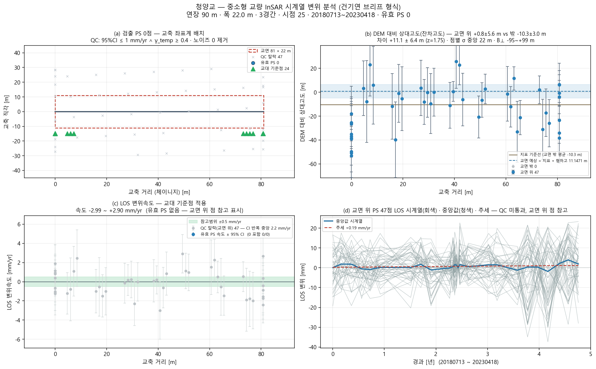

# 청양교 — 좌표 하나로 끝까지 (bridge_run)

`36.450655, 126.80732` · 트랙 `track_deck2.h5`

## 무엇을 어디서 가져왔나

| 항목 | 출처 |
|---|---|
| specs | 파트너 실측 CSV '청양교' (43 m) |
| deck_match | CSV 연장 90 m 에 맞는 way 선택(2후보 중) |
| deck | OSM '청양교' 81 m · 방위 -174.9° |
| ground | Open-Meteo DEM |
| points | 쉬프트 7.4 m(heading 0.0°) 보정 후 데크 ±30 m 안 47/48 |
| clearance | 잔차고도 집단평균 +11.1±6.4 m (z=1.75) |

## 제원(적용값)

| 연장 | 경간 | 폭 | 형하고(δh) | 지면 | 데크 방위 |
|---|---|---|---|---|---|
| 90 m | 3 | 22.0 m | 11.1 m | 93.0 m | -174.9° |

## 결과

| | 값 |
|---|---|
| IFC 트윈 | 부재 7 · 점 47 · 결합 47 |
| 잔차고도 | 교면 위 − 밖 +11.1 ± 6.4 m (z=1.75) — 고도 차이를 유의하게 확인하지 못함(z≤2) — 감도 부족 |
| PINN · CRI | CRI 0.754 · 경고 |
| 감사 | **보고 가능**  |

ⓘ EI·고유진동수는 관측값이 아니라 **설계 제원(기하 EI) 기반** — InSAR 는 상대 변위라 절대 강성을 식별할 수 없다(f₁ 3.01Hz 는 물리 범위 안)

## 그림

3D: `twin.viewer.html` (속도) · `twin_cri.viewer.html` (CRI) — 더블클릭

## 적어 둘 것

- 경간수 없음 → 30 m 규칙으로 3 가정
- 형하고 6.0 m 가정(표준데이터 교량높이 없음) — 잔차고도로 대체 시도
