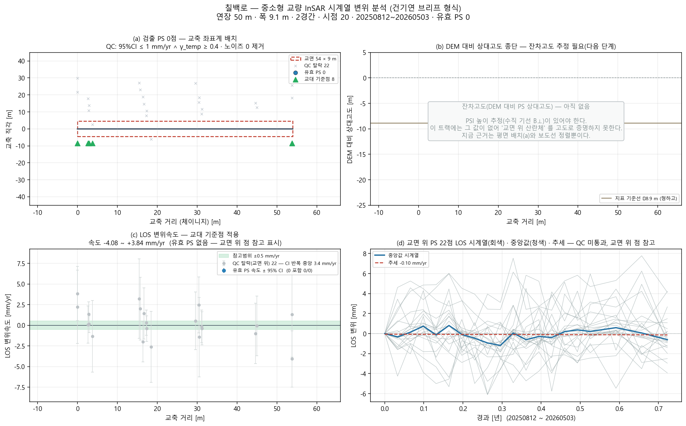

# 칠백로 — 좌표 하나로 끝까지 (bridge_run)

`35.903424, 128.926739` · 트랙 `honam_track_asc.h5`

## 무엇을 어디서 가져왔나

| 항목 | 출처 |
|---|---|
| specs | 파트너 실측 CSV '호남육교' (0 m) |
| bridge_type | CSV '강박스거더교' → box_girder |
| clearance | 전국교량표준데이터 교량높이 8.9 m |
| deck_match | CSV 연장 50 m 에 맞는 way 선택(1후보 중) |
| deck | OSM '칠백로' 54 m · 방위 105.4° |
| ground | Open-Meteo DEM |
| points | 쉬프트 11.1 m(heading -13.1°) 보정 후 데크 ±30 m 안 22/118043 |

## 제원(적용값)

| 연장 | 경간 | 폭 | 형하고(δh) | 지면 | 데크 방위 | 형식(PINN PDE) | 시점 |
|---|---|---|---|---|---|---|---|
| 50.0 m | 2 | 9.1 m | 8.9 m | 103.0 m | 105.4° | box_girder · steel | 20 |

## 결과

| | 값 |
|---|---|
| IFC 트윈 | 부재 5 · 점 22 · 결합 20 |
| 잔차고도 | 없음(SNAP star 산출물 필요) |
| PINN · CRI | CRI 0.808 · 경고 |
| 감사 | **조건부** · 언래핑 여부 불명(변위가 작아 판단 보류) |

ⓘ EI·고유진동수는 관측값이 아니라 **설계 제원(기하 EI) 기반** — InSAR 는 상대 변위라 절대 강성을 식별할 수 없다(f₁ 5.28Hz 는 물리 범위 안)

## 그림

3D: `twin.viewer.html` (속도) · `twin_cri.viewer.html` (CRI) — 더블클릭

## 적어 둘 것

- 경간수 없음 → 30 m 규칙으로 2 가정
- SNAP star 처리 폴더도 SARvey 기선 JSON 도 없음 → 잔차고도 불가(브리프 (b) 비움)

## 이 파이프라인이 원리상 못 하는 것 (모든 교량 공통)

- **EI(강성) 관측 식별** — InSAR 는 상대 변위라 자중 처짐을 못 본다. EI·f₁ 은 설계 제원 기반이다(감사 ⓘ).
- **데크 위 PS 밀도** — Sentinel-1 화소 ~11 m. 프로그램으로 늘릴 수 없다. 고해상도 SAR·코너리플렉터가 답이다.
- **쉬프트 방향(각도)** — 궤도 heading 이 정한다. 크기 δh 만 잔차고도로 관측값이 된다.
- **시점 수** — 속도 95 % CI 는 시점 수와 기간이 정한다(20시점). 브리프 기준(≥100장)에 못 미치면 판정을 보류한다.
