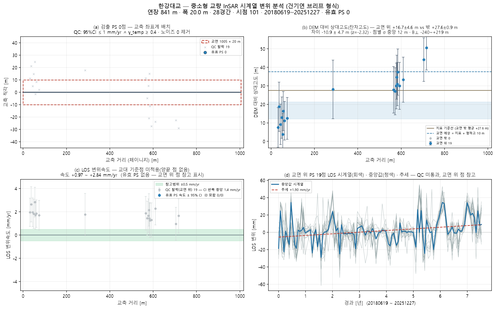

# 한강대교 — 좌표 하나로 끝까지 (bridge_run)

`37.517823, 126.95903` · 트랙 `track_한강대교.h5`

## 무엇을 어디서 가져왔나

| 항목 | 출처 |
|---|---|
| specs | 파트너 실측 CSV '한강대교(구교)' (502 m) |
| bridge_type | CSV '아치교' → arch |
| clearance | 전국교량표준데이터 교량높이 10 m |
| deck | 전국교량표준데이터 '한강대교(구교)' 시점–종점 선분 1005 m (등록 연장 841 m · 차이 +19 %) |
| ground | Open-Meteo DEM |
| ground_offset | 처리 오프셋 ≈ 0 (|B| 0.0 m < 3 m · 지면 점 26 · 도로 양쪽 대칭) |
| points | 쉬프트 11.5 m(heading -13.3°) 보정 후 데크 ±30 m 안 19/20000 |

## 제원(적용값)

| 연장 | 경간 | 폭 | 형하고(δh) | 지면 | 데크 방위 | 형식(PINN PDE) | 시점 |
|---|---|---|---|---|---|---|---|
| 841.0 m | 28 | 20.0 m | 10.0 m | 12.0 m | 62.9° | arch · ? | 101 |

## 결과

| | 값 |
|---|---|
| IFC 트윈 | 부재 57 · 점 19 · 결합 16 |
| 잔차고도 | 교면 위 − 밖 -10.9 ± 4.7 m (z=-2.32) — ⚠ '교면 위' 점이 지면보다 유의하게 **낮다**(z<−2) — 교면 산란체가 아닐 수 있다(제방·교대 주변 지면). 평면 선택을 다시 볼 것 |
| PINN · CRI | CRI 0.801 · 경고 |
| 감사 | **보고 불가** · 대상 교량 30m 내 0점(최근접 65.3m) · CRI 등급은 **잠정** — 관측조건이 기준치 학습 조건과 다르다(노이즈 15.5mm vs 기준 10.0mm(1.6배) · 관측기간 2748d vs 기준 552d). 등급을 구조 상태로 읽으면 안 된다 |

ⓘ EI·고유진동수는 관측값이 아니라 **설계 제원(기하 EI) 기반** — InSAR 는 상대 변위라 절대 강성을 식별할 수 없다(f₁ 1.74Hz 는 물리 범위 안)

## 그림

3D: `twin.viewer.html` (속도) · `twin_cri.viewer.html` (CRI) — 더블클릭

## 적어 둘 것

- OSM 어느 way 도 연장 841 m 와 안 맞음 (토막난 way) → 표준데이터 시점–종점 선분 사용
- 경간수 없음 → 30 m 규칙으로 28 가정
- ⚠ '교면 위' 점이 지면보다 유의하게 **낮다**(z<−2) — 교면 산란체가 아닐 수 있다(제방·교대 주변 지면). 평면 선택을 다시 볼 것

## 이 파이프라인이 원리상 못 하는 것 (모든 교량 공통)

- **EI(강성) 관측 식별** — InSAR 는 상대 변위라 자중 처짐을 못 본다. EI·f₁ 은 설계 제원 기반이다(감사 ⓘ).
- **데크 위 PS 밀도** — Sentinel-1 화소 ~11 m. 프로그램으로 늘릴 수 없다. 고해상도 SAR·코너리플렉터가 답이다.
- **쉬프트 방향(각도)** — 궤도 heading 이 정한다. 크기 δh 만 잔차고도로 관측값이 된다.
- **쉬프트의 세 층** — A 기하(δh/tanθ, 보정) · B 처리 오프셋(지면 점 vs OSM 도로선으로 추정, 유의하면 제거) · C 산란체 위치(보도·난간 — 쉬프트가 아님). B 는 OSM 기준 상대값이라 3~5 m 아래는 못 본다.
- **시점 수** — 속도 95 % CI 는 시점 수와 기간이 정한다(101시점). 브리프 기준(≥100장)에 못 미치면 판정을 보류한다.
