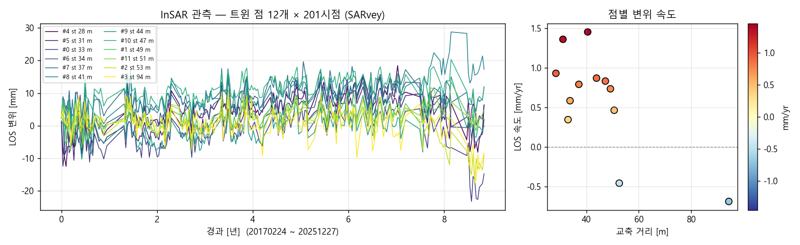
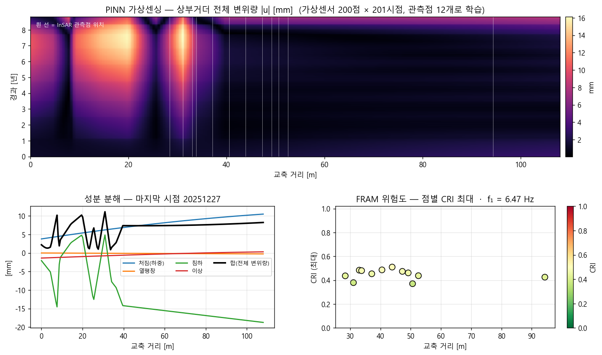
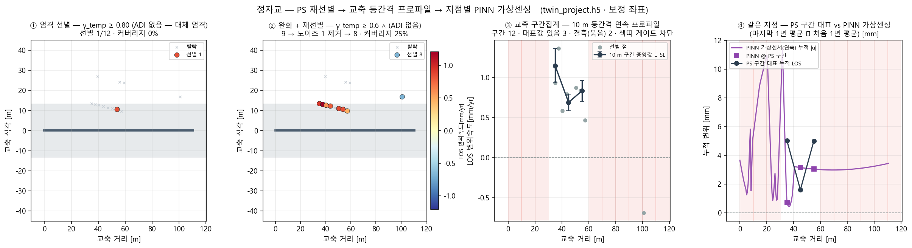

# 트윈에서 도출한 InSAR · PINN · CRI — 정자교

트윈이 실제로 쓴 **같은 12점**으로 돌린 결과다. 다른 산출물의 값을 가져다 붙이지 않았다.
다시 만들기: `python scripts/make_demo_twin.py` (6단계). 프로젝트: `twin_project.h5`.

## 입력

| | 값 |
|---|---|
| 관측 | SARvey PS/DS · 12점 × 201시점 · 20170224 ~ 20251227 |
| 선택 | 쉬프트 6.78 m 보정(heading -13.25°) 후 데크 중심선 ±30 m · 교축 −5~113 m |
| 제원 | 연장 108 m · 5경간 · 폭 26.5 m · 형하고 6.0 m (표준데이터 + OSM) |
| PINN 제원 출처 | specs_csv:bridges_load.csv, bridges_specs.csv |

## InSAR (관측)

| | 값 |
|---|---|
| LOS 속도 | -0.69 ~ +1.45 mm/yr (중앙 +0.76) |
| 관측 기간 | 201시점 · 8.8년 |

## PINN (가상센싱)

| | 값 | 물리 기준 |
|---|---|---|
| 전체 변위량 |u| 최대 | 16.15 mm (가상센서 200점) | — |
| 열 성분 최대 | 0.54 mm | 0 이면 분리 실패 |
| 변형률 최대 | 2.90e-07 | 파괴 3e−3 |
| 응력 최대 | 0.010 MPa | 콘크리트 30~50 |
| f₁ | 6.47 Hz (f₁ × 구조경간 21.6 m = 140) | 10~600 (감사표 ⑥ 기준) |
| EI | 설계 제원(기하 EI) 기반 — InSAR 는 상대 변위라 절대 강성 식별 불가 | ⓘ |

## PS 재선별 → 교축 등간격 프로파일 → 지점별 PINN

| 단계 | 기준 | 결과 |
|---|---|---|
| ① 엄격 | ADI ≤ 0.25 (이 트랙은 ADI 없음 → γ_temp ≥ 0.80 대체) | 1점 · 커버리지 0 % |
| ② 완화+재선별 | ADI ≤ 0.40 ∧ γ_temp ≥ 0.60 → 노이즈 점 제거 | 9 → 8점 |
| ③ 구간집계 | 교축 10 m 등간격 · 중앙값 ± SE | 12구간 중 3구간에 대표값 · 커버리지 25 % |
| ④ 지점별 PINN | PS 구간 대표 누적 vs PINN 가상센서 누적 | 3구간 RMS 2.9 mm · **PS 없는 0~30 m 는 PINN 이 요동** |

**각 지점에 PS 가 있어야 그 지점의 가상센싱을 말할 수 있다** — ④가 그것을 보여준다.
색띠 게이트(커버리지 70 %·σ_b/σ_w 1.5)는 차단이므로 3D 데크에 프로파일을 칠하지 않는다.

## FRAM (위험도)

| | 값 |
|---|---|
| CRI 최대 | **0.510** |
| 경보 | **정상** (reference_range) |
| 점별 CRI 최대 범위 | 0.371 ~ 0.510 |

3D 로 보기: `twin_cri.viewer.html` (CRI 채널) · `twin.viewer.html` (속도 채널)

## 읽을 때 주의

- 12점은 데크 남측 보도·난간 위 산란체로 해석된다(1화소급 잔여 오프셋은 배제 못 함).
- 관측점은 교축 28~53 m 에 11점, 94 m 에 1점이다. **그 밖(0~28 m · 55~90 m · 95~108 m)의
  가상센싱 값은 외삽**이라 관측 구간보다 불확실하다. 그림 위 흰 선이 관측점 위치다.
- EI·f₁ 은 관측이 아니라 설계 제원 기반이다. InSAR 가 주는 것은 변위 속도·이상·위험도다.
- CRI 는 FRAM 의 상대 지표다. 이 값만으로 구조 안전을 판정하지 않는다.
