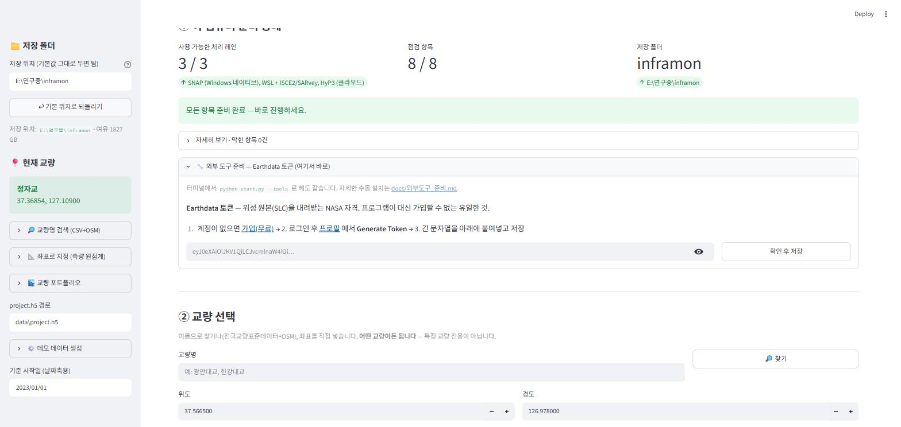
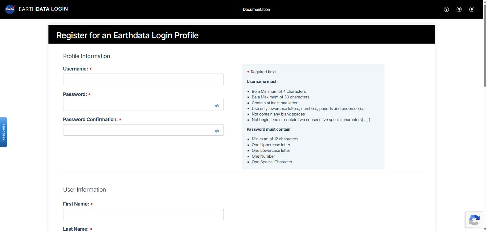

# 외부 도구 준비 — Earthdata 토큰 · SNAP · snaphu

위성 원본(SLC)부터 돌리려면 이 셋이 필요합니다. `doctor` 의 `[외부 도구·자격]` 세 줄이 그것입니다.

| | 무엇 | 왜 | 사람이 꼭 할 일 |
|---|---|---|---|
| **Earthdata 토큰** | NASA Earthdata Login 의 60일짜리 접근 토큰 | Sentinel-1 SLC 를 ASF 에서 내려받는 자격 | **가입** (무료, 3분). 나머지는 프로그램이 |
| **SNAP** | ESA 의 InSAR 처리 프로그램 (`gpt`) | SLC → 코레지 → 간섭도 → 지오코딩 | 없음 — 프로그램이 받아서 무인 설치 |
| **snaphu** | 위상 언래핑 프로그램 (Stanford) | 이게 없으면 LOS 가 ±λ/4 에 갇혀 결과가 무의미 | WSL 이 없을 때 관리자 승인 + 재부팅 한 번 |

## 가장 빠른 길 — 세 가지 중 하나

| 방법 | 어디서 | 언제 |
|---|---|---|
| **A. 대시보드** | ① 이 컴퓨터 준비 상태 → **🔧 외부 도구 준비** 펼침 → 버튼/붙여넣기 (아래 그림) | 화면이 열려 있을 때 |
| **B. 터미널 한 줄** | `python start.py --tools` | 대시보드 없이. 빠진 것만 채움, 몇 번 해도 됨 |
| **C. 한 줄 설치기** | `irm https://raw.githubusercontent.com/tjddnr8334-sudo/inframon/main/install.ps1 \| iex` | 새 컴퓨터. B 를 포함 |



셋 다 같은 코드(`src/inframon/setup_tools.py`)를 돌립니다. 없는 것만 보여 주고, 다 되면 이 펼침 자체가 사라집니다. 아래는 **각 도구가 어떻게 되는지**와, 자동이 안 될 때 **손으로 하는 법**입니다.

---

## 1. Earthdata 토큰

### 1-1. 계정 만들기 (한 번, 무료)

<https://urs.earthdata.nasa.gov/users/new>



| 칸 | 넣을 것 |
|---|---|
| Username | 소문자·숫자·`.`·`_` 4~30자 (예: `hong.gildong`) — **나중에 필요하니 적어 두기** |
| Password / Confirmation | 12자 이상, 대문자·소문자·숫자·특수문자 각 1개 이상 |
| First / Last Name, E-mail | 실명·실제 메일 (인증 메일이 옴) |
| Country | Republic of Korea |
| Affiliation | 소속 종류 (University, Government, Commercial …) |
| Study Area / User Type / Organization | 선택 — 비워도 됨 |

**CONTINUE** → 메일함의 인증 링크 클릭 → 로그인 되면 끝.

### 1-2. 토큰 발급 → 프로그램에 등록

**자동 (권장)** — 대시보드 **🔧 외부 도구 준비** 또는 `python start.py --tools`:

1. 프로그램이 브라우저에 <https://urs.earthdata.nasa.gov/profile> 을 엽니다 (로그인 요구되면 로그인).
2. 프로필 화면 위쪽 작은 메뉴에서 **Generate Token** → 아래쪽 **GENERATE TOKEN** 버튼.
3. 토큰이 가려진 채 나옵니다 → **Show Token** → `eyJ0eXAiOi…` 로 시작하는 긴 문자열 전체 복사.
4. 터미널(또는 대시보드 칸)에 붙여넣고 Enter.
   프로그램이 NASA 서버(CMR)에 그 토큰으로 한 번 조회해 **진짜 유효한지 확인한 뒤에만** `~/.inframon/earthdata_token` 에 저장합니다 (소유자만 읽기).

**수동** — 토큰을 이미 복사해 뒀다면:

```powershell
python -m inframon --earthdata-save <붙여넣은 토큰>
```

**확인**: `python -m inframon --doctor` →  `✅ Earthdata 토큰   C:\Users\…\.inframon\earthdata_token (만료 D-59)`

### 1-3. 알아둘 것

- 토큰은 **60일** 유효, 한 계정에 **최대 2개**. 셋째를 만들려면 프로필의 토큰 목록에서 하나를 ✕ 로 지웁니다.
- 만료 7일 전부터는 `--tools`(대시보드 포함)가 **자동으로 갱신**합니다 (EDL `renew_token`). 다시 붙여넣지 않아도 됩니다. doctor 에 `만료됨` 이 뜨면 1-2 를 다시.
- 토큰은 비밀번호와 같습니다. 저장소·메일·캡처에 넣지 마세요. 프로그램도 파일 하나(`~/.inframon/earthdata_token`)에만 두고 절대 커밋하지 않습니다.
- 환경변수로 줘도 됩니다: `EARTHDATA_TOKEN` (파일보다 우선).

### 1-4. 안 될 때

| 증상 | 원인 → 조치 |
|---|---|
| 저장 시 `CMR 401: Token does not exist` | 복사가 잘렸거나 다른 계정 토큰 → Show Token 에서 **전체** 를 다시 복사 (앞뒤 공백·줄바꿈 제거는 프로그램이 함) |
| 토큰은 ✅ 인데 SLC 다운로드가 401/403 | ASF 앱 승인이 안 됨 → <https://search.asf.alaska.edu> 에 그 계정으로 한 번 로그인해 "Alaska Satellite Facility Data Access" 승인 (또는 <https://urs.earthdata.nasa.gov/approved_applications>) |
| `max_token_limit` | 토큰 2개가 이미 있음 → 프로필 토큰 목록에서 하나 삭제 |
| 인증 메일이 안 옴 | 스팸함. 그래도 없으면 프로필에서 메일 재발송 |

---

## 2. SNAP (ESA)

### 2-1. 자동 (권장)

대시보드 **⬇ SNAP 내려받아 설치** 버튼 또는 `python start.py --tools`:

1. ESA 공식 설치기 `esa-snap_sentinel_windows-14.0.0.exe` (1.12 GB) 를 `~/.inframon/downloads/` 에 받습니다 (5% 마다 진행률). 이미 받아둔 파일이 있으면 다시 받지 않습니다.
2. **무인 설치** (`-q -dir`) → `C:\Users\(이름)\AppData\Local\Programs\esa-snap`. 창이 뜨지 않고 3~10분. 관리자 권한 불필요.
3. `bin\gpt.exe` 경로를 `~/.inframon/tools.json` 에 기록 → 이후 모든 실행이 이 gpt 를 씁니다.

**확인**: `python -m inframon --doctor` → `✅ SNAP gpt   C:\Users\…\esa-snap\bin\gpt.exe`

### 2-2. 수동

1. <https://step.esa.int/main/download/snap-download/> → **SNAP Sentinel Toolboxes · Windows 64-bit** (all Toolboxes 도 됨).
2. 설치기 실행 → 전부 기본값 **Next**. (Python 연동 물으면 No.)
3. 기본 위치 `C:\Program Files\esa-snap` 은 프로그램이 자동 인식합니다. 다른 곳에 깔았다면:
   ```powershell
   [Environment]::SetEnvironmentVariable("INFRAMON_SNAP_GPT", "D:\snap\bin\gpt.exe", "User")
   ```
   (PowerShell 새로 열기)

### 2-3. 알아둘 것

- `gpt` 첫 실행은 1~2분 걸립니다 (모듈 초기화). 이후는 빠릅니다.
- SNAP 10 이상이면 됩니다. 이미 깔린 SNAP 이 있으면 자동 설치를 하지 않고 그것을 씁니다.
- 디스크 1.3 GB (설치) + 1.1 GB (설치기, 지워도 됨: `~/.inframon/downloads`).
- SNAP 의 데이터 캐시(`~/.snap`)가 커집니다 (수 GB). 다른 드라이브로 옮기려면 `~/.snap/etc/snap.properties` 의 `snap.userdir`.

### 2-4. 안 될 때

| 증상 | 조치 |
|---|---|
| 다운로드가 중간에 끊김 | 같은 명령 다시 — `.part` 를 지우고 새로 받음. ESA 서버가 느린 시간대(유럽 낮)를 피하면 빠름 |
| `설치 실패(rc=…)` | `~/.inframon/downloads/esa-snap_…exe` 를 **더블클릭**해 화면 설치 → 프로그램이 `C:\Program Files\esa-snap` 을 인식 |
| doctor 에 `SNAP gpt 없음` 인데 깔려 있음 | 2-2 의 3번 (`INFRAMON_SNAP_GPT`) |
| `gpt` 가 Java 메모리 오류 | `esa-snap\bin\gpt.vmoptions` 의 `-Xmx` 를 RAM 의 60% 로 (예: `-Xmx16G`) |

---

## 3. snaphu (위상 언래핑)

snaphu 는 Windows 빌드가 없어 **WSL(Windows Subsystem for Linux) 안의 Ubuntu** 에 깝니다. 프로그램은 SNAP 이 만든 파일을 WSL 경로(`/mnt/c/…`)로 넘겨 언래핑하고 돌려받습니다 — 사용자는 WSL 을 직접 쓸 일이 없습니다.

### 3-1. 자동 (권장)

대시보드 **⬇ snaphu 설치** 버튼 또는 `python start.py --tools`:

- **WSL 이 이미 있으면** → `wsl -u root apt-get install snaphu` (1~3분, 비밀번호 없음). 끝.
- **WSL 이 없으면** → 관리자 승인 창(UAC)이 뜹니다 → **예** → `wsl --install -d Ubuntu` 가 돌고 → **재부팅** → 다시 같은 버튼/명령 → 이번엔 위 apt 설치.

**확인**: `python -m inframon --doctor` → `✅ snaphu   wsl:/usr/bin/snaphu`

### 3-2. 수동

관리자 PowerShell (Win+X → **터미널(관리자)**):

```powershell
wsl --install -d Ubuntu      # 없을 때만. 끝나면 재부팅
```

재부팅 후 일반 PowerShell:

```powershell
wsl -d Ubuntu -u root -- apt-get update
wsl -d Ubuntu -u root -- apt-get install -y snaphu
wsl -d Ubuntu -- snaphu -h   # 사용법이 찍히면 성공
```

(Ubuntu 를 처음 열면 사용자 이름·비밀번호를 만들라고 할 수 있습니다 — 아무거나. 프로그램은 root 로 들어가므로 상관없습니다.)

### 3-3. 알아둘 것

- 회사 PC 에서 WSL 설치가 정책으로 막혀 있을 수 있습니다 → IT 에 "Windows 기능: Virtual Machine Platform + Windows Subsystem for Linux" 요청.
- 디스크 2~3 GB (Ubuntu).
- 대안: conda 가 있으면 `conda install -c conda-forge snaphu` (Linux/macOS 만). Windows 에서는 WSL 이 유일한 실용적 방법입니다.
- 언래핑이 실패하면 프로그램이 파라미터를 4단계(타일링 → MCF → SMOOTH)로 바꿔 재시도하고 `unwrap_retry.json` 에 남깁니다 — snaphu 설치 문제가 아닙니다.

### 3-4. 안 될 때

| 증상 | 조치 |
|---|---|
| UAC 창을 '아니오' 함 / `승격이 거부` | 3-2 를 관리자 PowerShell 에서 직접 |
| `wsl --install` 후에도 doctor 에 없음 | 재부팅을 안 했거나 Ubuntu 가 아직 초기화 전 → 시작 메뉴에서 **Ubuntu** 한 번 실행 → 다시 `--tools` |
| `WslRegisterDistribution failed 0x8007019e` | Windows 기능이 꺼짐 → 관리자 PowerShell: `dism /online /enable-feature /featurename:Microsoft-Windows-Subsystem-Linux /all /norestart` + `…:VirtualMachinePlatform …` → 재부팅 |
| BIOS 가상화 꺼짐 (`0x80370102`) | BIOS 에서 Intel VT-x / AMD-V 켜기 |
| apt 가 네트워크 오류 | 회사 프록시 → WSL 안 `/etc/apt/apt.conf.d/proxy.conf` 에 `Acquire::http::Proxy "http://…";` |

---

## 4. 셋 다 됐는지 한 번에

```powershell
python -m inframon --doctor
```

```
  [외부 도구·자격]
    ✅ Earthdata 토큰   C:\Users\…\.inframon\earthdata_token (만료 D-58)
    ✅ SNAP gpt       C:\Users\…\AppData\Local\Programs\esa-snap\bin\gpt.exe
    ✅ snaphu         wsl:/usr/bin/snaphu
  [가능한 기능]
    ✅ slc_download  ✅ insar_snap  ✅ unwrap_snaphu  ✅ full_pipeline
```

`full_pipeline ✅` 이면 대시보드 ③ **▶ 전체 실행** 이 SLC 다운로드부터 트윈까지 끝까지 돕니다.
