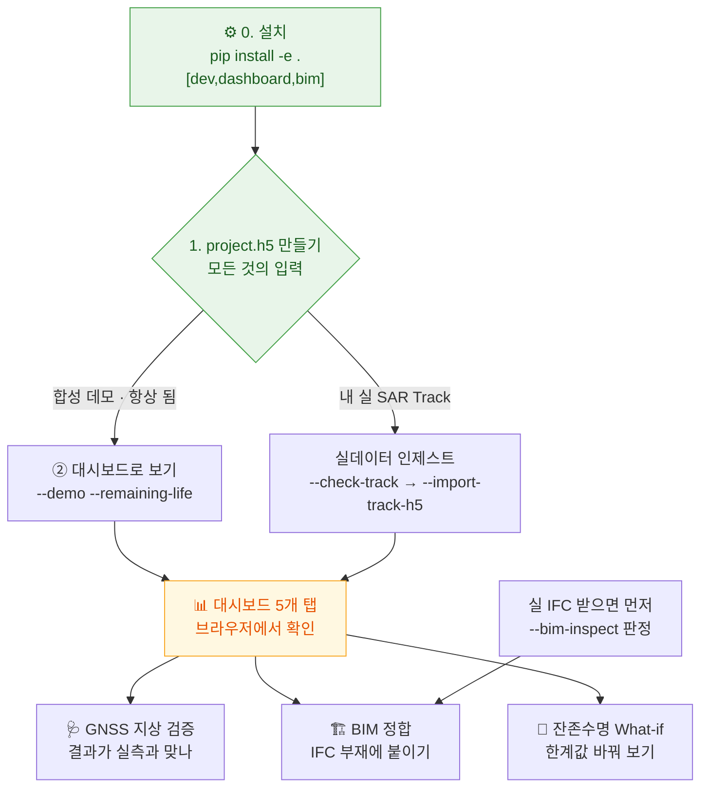

# 테스트 가이드 — 직접 돌려 보기

복붙하면 되는 수준으로 정리했다. **네트워크·실데이터·WSL 없이** 합성 데이터로 전 기능이
돌아간다. 내 실 데이터(IFC·SAR Track)를 넣는 법은 §5.

> 막히면 각 절 끝의 "안 되면" 을 보라. 대부분 설치 옵션 하나 차이다.

---

## 실행 순서 — 무엇이 무엇을 필요로 하나

핵심은 **`project.h5` 하나가 모든 것의 입력**이라는 점이다. 그걸 먼저 만들고, 나머지는
그 위에서 돈다. 화살표는 "이게 있어야 저게 된다".

> **아래 순서도의 각 상자를 클릭하면** 해당 단계 설명으로 바로 간다(GitHub 에서 렌더될 때).



텍스트로 같은 흐름 (mermaid 가 안 보이면):

```
 [설치]  pip install -e ".[dev,dashboard,bim]"   →  --doctor 로 확인
    │
    ▼
 ┌─────────────────────── project.h5 를 만든다 (둘 중 하나) ───────────────────────┐
 │                                                                                │
 │  A. 합성 데모 (네트워크·데이터 불필요, 항상 됨)                                 │
 │     python -m inframon --demo --remaining-life --out data/project.h5           │
 │                                                                                │
 │  B. 내 실 SAR Track (SARvey/MintPy H5 가 있을 때)                              │
 │     python -m inframon --check-track 내트랙.h5          # 먼저 사전검증         │
 │     python -m inframon --import-track-h5 내트랙.h5 --insar-corrections \        │
 │       --remaining-life --out data/project.h5                                   │
 └────────────────────────────────────────────────────────────────────────────────┘
    │
    │  ← 이제 project.h5 가 생겼다. 아래는 순서 무관, 필요한 것만.
    ├──────────────┬──────────────────┬─────────────────────────┐
    ▼              ▼                  ▼                         ▼
 [대시보드]     [GNSS 검증]        [BIM 정합]                [잔존수명만 다시]
 브라우저로     결과가 지상        project.h5 를 IFC          한계값 바꿔가며
 5개 탭 확인    실측과 맞나        부재에 붙인다              --life-* 플래그
 (§2)          (§3-4, 네트워크)   (§4 데모 / §5-A 실IFC)     (§3-3)

 실 IFC 를 받았을 때만:
    --bim-inspect 내파일.ifc   ← 항상 이것부터. 무엇이 더 필요한지 판정이 나온다.
```

**요약하면**: ① 설치 → ② `project.h5` 만들기(데모 또는 실 Track) → ③ 그 위에서
대시보드·GNSS·BIM·잔존수명. 처음이면 **§1 → §2 순서**로만 따라와도 전체를 본다.

---

## 0. 설치 (한 번)

```bash
git clone https://github.com/tjddnr8334-sudo/inframon.git
cd inframon
python -m pip install --upgrade pip
pip install -e ".[dev,dashboard,bim]"      # 코어+테스트+대시보드+IFC
python -m inframon --doctor                # 마지막 줄이 "✅ 코어 동작 가능" 이면 준비 끝
```

- **PINN real** 을 쓰려면 torch 가 필요하다: `pip install torch`(CPU 면 충분).
- **IFC** 를 안 쓸 거면 `bim` 빼도 된다(부재 테이블 CSV 로 대체 가능, §4).
- **안 되면**: `--doctor` 출력에서 ❌ 인 항목이 그 기능의 의존성이다. 필요 없으면 무시.

---

## 1. 30초 스모크 테스트 — 진짜 도는지

```bash
python -m inframon --demo --out data/project.h5
```

마지막에 `최대 CRI : 0.653`, `경보 등급 : 경고` 가 나오면 전 파이프라인
(CV→InSAR→PINN→FRAM)이 합성으로 완주한 것이다. **네트워크 불필요, 고정 시드라 항상 같은 값.**

```bash
pytest -q          # 전체 테스트 (679개, ~1.5분). 실데이터/WSL 불필요.
```

---

## 2. 대시보드를 브라우저에서 (가장 직관적)

```bash
python -m inframon --demo --out data/project.h5      # 아직 안 했으면
streamlit run src/inframon/dashboard/app.py
```

브라우저가 열리면(안 열리면 터미널의 `Local URL`) 상단 라디오로 **5개 탭**을 눌러 본다:

| 탭 | 보는 것 |
|---|---|
| **① InSAR** | 변위 시계열·속도 지도. 지도에서 교량을 이름으로 검색할 수 있다 |
| **② PINN** | 물리 성분분해(열팽창·하중·침하)·구조응답·EI |
| **③ FRAM** | 공명 위험 지수 CRI·경보·위험 히트맵 |
| **④ 잔존수명** | 사용성 한계까지 남은 시간, 채널별 활성/비활성 **사유**, 핫스팟, 가정 패널, **파라미터 What-if** |
| **⑤ PSI 방법론** | PS·SBAS·QPS 비교(별도 데이터 필요, 없으면 안내만) |

**상단 진행 배지** — 헤더에 `✅① InSAR · ✅② PINN · ✅③ FRAM · ✅④ 잔존수명` 로 어느
단계까지 돌았는지 나온다. 미완 단계는 `⬜` 이고 다음 할 일을 짚어 준다. 데이터가
중간에 어디까지 진행됐는지 한눈에 확인하는 용도.

**④ 잔존수명 탭의 What-if** — 맨 아래 "🔬 파라미터 바꿔 보기" 에서 침하·처짐·부등침하
한계값 슬라이더를 움직이면 잔존수명이 **즉시** 다시 계산된다. `project.h5` 는 **바뀌지
않는다**(미리보기). "이 값을 이만큼 바꾸면 결과가 얼마나 달라지나" 를 눈으로 보고 판단하라.
- "저장값 대비 +N년" 으로 변화량을 보여준다.
- **점별 지배 한계**(절대변위 / 부등침하)가 표시되니, 어느 슬라이더가 결과를 움직이는지
  안다(부등침하가 지배하면 침하 한계를 바꿔도 무반응인 게 정상).
- 확정하려면 패널의 CLI 명령(`--life-settlement-mm` 등)을 쓴다.

- **사이드바 `project.h5 경로`** 를 바꾸면 다른 프로젝트를 볼 수 있다.
- **안 되면**: `pip install -e ".[dashboard]"`. 포트 충돌이면
  `streamlit run ... --server.port 8502`.

---

## 3. CLI 명령을 직접 (스크립트로 자동화하고 싶을 때)

각 명령은 **끝나면 끝난다**(대시보드처럼 떠 있지 않는다). 무엇을 확인하는지 주석으로 달았다.

```bash
# 3-1. 환경 진단
python -m inframon --doctor

# 3-2. 데모 파이프라인 (엔진을 real 로 바꿔 가며)
python -m inframon --demo --out data/project.h5                      # 전부 stub(빠름)
python -m inframon --demo --engine pinn=real --engine fram=real \
  --out data/project_real.h5                                         # PINN/FRAM real (torch 필요)

# 3-3. 잔존수명 (사용성 한계까지 남은 시간)
python -m inframon --demo --remaining-life --out data/project.h5
#   → "잔존수명 ≥ N년 (하한, serviceability 지배)" + 채널별 활성/비활성 사유

# 3-4. GNSS 지상 대조 (네트워크 필요 — NGL 상시관측소)
python -m inframon --gnss-anchor 37.3634,127.1090 --gnss-km 60       # 처리 전: 기준점 근거
python -m inframon --gnss-validate data/project_real.h5 \
  --gnss-incidence 41.5 --gnss-km 60                                 # 결과 검증: 수직 잔차

# 3-5. IFC 사전점검 (실 IFC 받았을 때 §5 참고)
python -m inframon --bim-inspect model.ifc

# 3-6. 전체 도움말 (플래그 131개)
python -m inframon --help
```

- **안 되면**: `--gnss-*` 는 인터넷이 필요하다(NGL 공개 서버, 키 불필요). 회사 방화벽이면
  막힐 수 있다. 나머지는 전부 오프라인.

---

## 4. BIM 정합 — IFC 없이 부재 테이블로 먼저

실 IFC 가 아직 없어도 **부재 목록 JSON/CSV** 로 BIM 정합을 체험할 수 있다.
데모 프로젝트에 맞춘 부재 테이블이 저장소에 있다(`configs/demo/`).

```bash
# 데모 프로젝트(--demo 로 만든 project.h5)를 BIM 부재에 붙이기
python -m inframon --bim-align \
  data/project.h5,configs/demo/bim_elements.json,out/bridge \
  --bim-map-conversion configs/demo/bim_map_conversion.json \
  --bim-source-crs EPSG:5186 --bim-max-dist 30
#   → 연결 200/200점 (100%) → 부재 4/4
```

출력의 **경고**를 읽는 게 핵심이다 — "연결 N/M점", "관측점 없는 부재",
"부재 라벨 불일치". 결과는 `out/bridge_elements.json`(부재별 상태)과
`out/bridge_pset.json`(IFC 주입용).

> `configs/jeongjagyo/` 의 부재 테이블은 **실 정자교 로컬 좌표(미터)** 라 데모 프로젝트
> (합성 픽셀 좌표)와는 좌표계가 다르다. 데모에는 `configs/demo/` 를, 실 정자교
> 프로젝트에는 `configs/jeongjagyo/` 를 쓴다.

내 부재 테이블은 이 형식이면 된다(UTF-8/cp949 자동):

```csv
guid,name,ifc_type,xmin,ymin,zmin,xmax,ymax,zmax
DECK1,상판,IfcSlab,0,-5,8,100,5,9
PIER1,교각1,IfcColumn,30,-2,0,34,2,8
```

---

## 5. 내 실 데이터 넣기

### 5-A. 실 IFC (BIM 산출물)

```bash
pip install -e ".[bim]"                      # ifcopenshell
python -m inframon --bim-inspect 내파일.ifc  # ← 이것부터. 판정이 나온다.
```

판정이 **✅ 투입 가능**이면:

```bash
python -m inframon --bim-align data/project.h5,내파일.ifc,out/bridge \
  --bim-use-z --bim-write-ifc out/bridge_monitored.ifc
```

판정이 **⛔ IfcMapConversion 없음**이면 측량 기준점 3~4점이 필요하다 —
`configs/jeongjagyo/bim_control_points.example.json` 형식으로 만들어서:

```bash
python -m inframon --bim-align data/project.h5,내파일.ifc,out/bridge \
  --bim-control-points control.json --bim-max-rms 0.3 \
  --bim-write-ifc out/bridge_monitored.ifc
```

자세히: [`BIM_필요데이터.md`](BIM_필요데이터.md).

### 5-B. 실 SAR Track (SARvey/MintPy 산출 H5)

```bash
python -m inframon --check-track 내트랙.h5     # 투입 전 사전검증 (exit 0 = 가능)
python -m inframon --import-track-h5 내트랙.h5 --out data/내프로젝트.h5 \
  --insar-corrections --remaining-life
```

Track H5 를 어떻게 만드는지(SLC→SARvey, WSL2)는 [`실데이터_런북.md`](실데이터_런북.md).

- **안 되면**: `--check-track` 이 요구 형상을 알려준다. 좌표계·고도가 없다는 경고는
  정상이다(DEM 을 `--insar-dem` 으로 줄 수 있다).

---

## 6. 새 교량으로 시작하기

```bash
cp -r configs/jeongjagyo configs/내교량
# configs/내교량/bridge_target.json 의 좌표·OSM id·bbox 를 내 교량으로 바꾼다
```

공유·수정 규칙은 [`configs/README.md`](../configs/README.md).

---

## 무엇을 신뢰할 수 있나 (읽어 두면 좋음)

이 소프트웨어는 **관측 근거가 있을 때만 값을 낸다** — 근거가 부족하면 그럴듯한 값을
만들지 않고 **사유와 함께 비활성**한다(잔존수명 탭의 stiffness 채널이 그 예).

합성 데모의 숫자는 파이프라인이 도는지 보여줄 뿐 실제 진단이 아니다. 실 데이터 결과도
InSAR 점이 교량 위에 충분히 있어야 의미가 있다(매끈한 데크는 산란체가 희소 —
README Status 배너 참조). **점검 우선순위 스크리닝이지 안전 판정이 아니다.**

문제를 발견하면 [이슈](https://github.com/tjddnr8334-sudo/inframon/issues)로 알려 달라
(`.github/ISSUE_TEMPLATE` 양식). 실 데이터 파일은 붙이지 말고 `--check-track`/`--bim-inspect`
출력이나 형상 정보로 충분하다.
